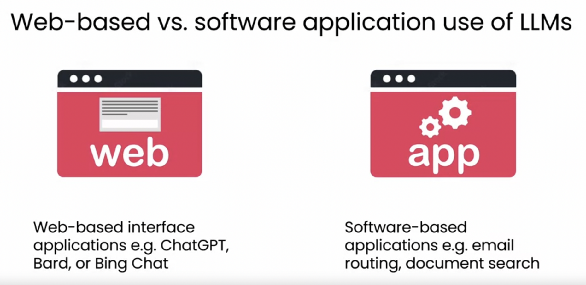

# Generative AI For Everyone

[Generative AI for Everyone Course](https://www.deeplearning.ai/courses/generative-ai-for-everyone/)

[Generative AI for Everyone Slides](https://docs.google.com/presentation/d/1u3Qwf8-VHf0tgmcvuC160p7JEvdAkkoAUWdvi4afk6A/edit?usp=sharing)

## [Using generative AI in software applications](https://www.coursera.org/learn/generative-ai-for-everyone/lecture/LfGc4/using-generative-ai-in-software-applications)

## [Lifecycle of a generative AI project](https://www.coursera.org/learn/generative-ai-for-everyone/lecture/t2aQM/lifecycle-of-a-generative-ai-project)

## Our Technology stack is OPL (OpenAI, Pinecone, and Langchain)

## We will develop prototype UI with [Streamlit](https://streamlit.io/)

## We will develop production apps using [Next.js](https://vercel.com/templates/next.js/langchain-starter)
