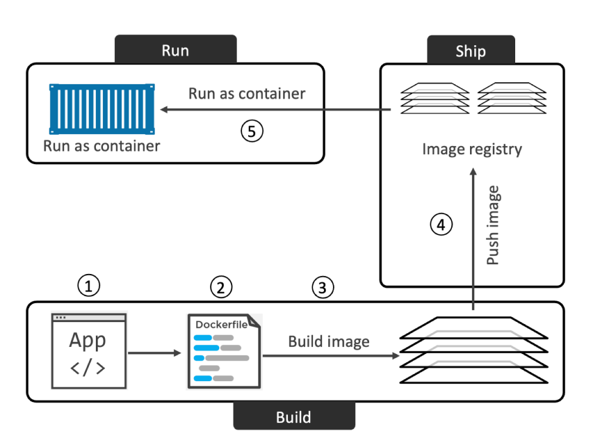

# Publish Your Images

[Read Pages 89-91 of our Text Book: Docker Deep Dive by Nigel Poulton 2023 Edition](https://www.amazon.com/Docker-Deep-Dive-Nigel-Poulton/dp/1916585256)

https://docs.docker.com/guides/walkthroughs/publish-your-image/

In order to get you started, let us get you a Docker ID.

https://hub.docker.com/

* Docker login:

        docker login

* Tag Image:
        
        docker tag test panacloud/test:latest

i.e. Docker ID is **panacloud** and container tag is **test:latest**

* Push your image to Docker Hub:

        docker push panacloud/test:latest

Check that the image you just pushed appears in Docker Cloud. Go to Docker Cloud and navigate to the Repositories tab and confirm that your image appears in this list.

