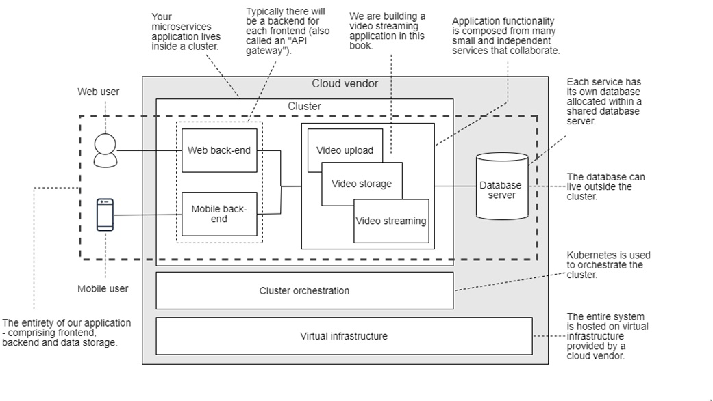

# What is a microservices application?

A **microservices application** is a **distributed program** composed of many small services that collaborate to achieve the features and functionality of the overall project.

A **microservices application** is a software application built using the **microservices architecture**. This architecture involves breaking down the application into **small, independent services** that each perform a specific function. These services are:

* **Independently deployable:** Each service can be deployed, updated, and scaled independently without affecting other parts of the application.
* **Loosely coupled:** Services communicate with each other through well-defined APIs, minimizing dependencies and making them easier to maintain and modify.
* **Focused on specific functionality:** Each service performs a single, well-defined task, promoting modularity and reusability.

Here's an analogy to understand a microservices application: Imagine a large restaurant. Traditionally, the entire operation might be managed as a single unit, with all tasks (cooking, serving, cleaning, etc.) handled by one team.

In a microservices approach, the restaurant would be divided into smaller, independent teams:

* **Kitchen service:** Responsible for preparing and cooking food.
* **Order processing service:** Takes orders from customers and relays them to the kitchen.
* **Billing service:** Handles payments and customer bills.
* **Cleaning service:** Maintains cleanliness throughout the restaurant.

These services would communicate with each other through well-defined protocols, allowing them to operate independently and scale as needed.

**Benefits of microservices applications:**

* **Increased agility and faster development:** Easier to make changes and deploy new features.
* **Improved scalability and fault tolerance:** Individual services can be scaled independently and failures are contained within specific services.
* **Enhanced maintainability and flexibility:** Easier to understand, modify, and update individual services.

**However, microservices applications also come with challenges:**

* **Increased complexity:** Managing distributed systems can be more complex than monolithic applications.
* **Potential for higher operational overhead:** Requires additional effort to monitor, log, and troubleshoot issues across multiple services.
* **Need for robust communication and API management:** Efficient communication and API design are crucial for successful implementation.

Overall, microservices applications offer a powerful approach for building modern, scalable, and maintainable software applications. 

