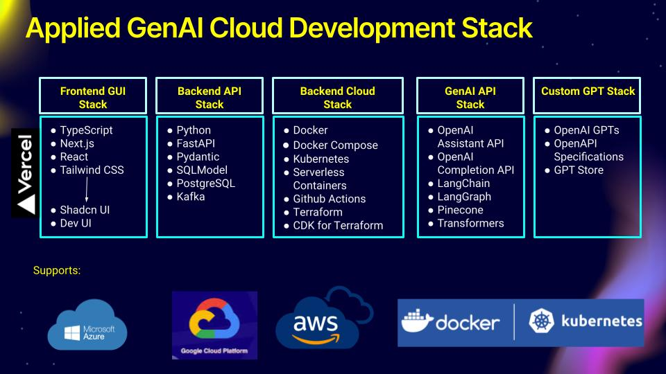

# Microservices: All-In-One-Platform That Avoids Cloud-Vendor Lock-in

Our vision is to build microservices on an all-in-one platform for microservices that is free from cloud-vendor lock-in.

Docker, Kubernetes, Serverless Containers, Terraform, FastAPI, PostgreSQL, Github Actions and Kafka—are indeed central to building and managing microservices architectures, but they each serve different purposes within the ecosystem. Let's break down their roles and discuss whether they can collectively provide an all-in-one platform that avoids cloud-vendor lock-in:

1. **Docker**: Docker is a containerization platform that allows you to package your application and its dependencies into a container that can run on any machine that has Docker installed. This helps in ensuring consistency across different development, testing, and production environments. Docker itself doesn't eliminate cloud-vendor lock-in, but it does make it easier to move containers between different cloud environments.

2. **Kubernetes**: Kubernetes is an open-source container orchestration platform that automates the deployment, scaling, and management of containerized applications. It works well with Docker and other container runtimes. Kubernetes is cloud-agnostic and can run on any infrastructure, be it on-premises, public cloud, or a hybrid setup, thus helping to avoid vendor lock-in.

3. **Serverless Containers**: These are typically services provided by cloud vendors (like AWS Fargate or Google Cloud Run) that allow you to run containers without managing the underlying servers. While serverless containers abstract away much of the infrastructure management, they are often tied to a specific cloud provider, which can lead to vendor lock-in unless you use an abstraction layer that allows for portability.

4. **Terraform**: Terraform is an infrastructure as code software tool that enables you to define and provision a datacenter infrastructure using a high-level configuration language. It is cloud-agnostic, supporting multiple service providers, and can help prevent vendor lock-in by allowing you to manage infrastructure across different cloud providers using the same tooling.

5. **FastAPI**: FastAPI is a modern, fast web framework for building APIs with Python, based on standard Python type hints. It is not tied to any cloud vendor and can run anywhere Python is supported, contributing to its cloud-agnostic nature.

6. **PostgreSQL**: PostgreSQL is an open-source relational database system. As a standalone database, it does not tie you to any cloud vendor and can run in various environments, including cloud platforms, on-premises, and as a service managed by cloud providers.

7. **Kafka**: Apache Kafka is an open-source stream-processing software platform developed by the Apache Software Foundation, written in Scala and Java. It's a distributed event store and stream-processing platform that can run on various infrastructures, which helps in avoiding lock-in.

8. **GitHub Actions**: This CI/CD tool allows automation of workflows and can deploy to any cloud provider. The use of GitHub Actions does not lock you into a specific cloud vendor.

When used together, these technologies can indeed form the backbone of a microservices platform that minimizes the risk of cloud-vendor lock-in. However, it's important to note that avoiding vendor lock-in entirely can be challenging. While the technologies listed are mostly open-source and can be run on various cloud providers or on-premises, the implementation details can vary. For instance:

- Using managed services like Amazon RDS for PostgreSQL or Confluent Cloud for Kafka does introduce a level of vendor-specific features and dependencies.
- Cloud-specific services and APIs that enhance your microservices (such as identity management, monitoring, and logging) may not have direct equivalents in other clouds or on-premises.
- Serverless containers and functions as a service (FaaS) offerings tend to be vendor-specific, even though they can run containers from anywhere.

In practice, using these technologies requires careful planning to ensure that your microservices architecture doesn't inadvertently rely on vendor-specific features that could hinder portability. It may also require additional abstraction layers or use of multi-cloud management tools to truly enable a seamless transition between environments.

Therefore, while these tools and platforms can support an architecture that reduces vendor lock-in, they do not eliminate it. They must be used judiciously, with a clear strategy for maintaining portability and avoiding reliance on proprietary features.

**Cloud-vendor lock-in considerations:**

* **Kubernetes:** Managed Kubernetes services offered by cloud providers might have lock-in due to proprietary features or integrations. Using vanilla open-source Kubernetes on your own infrastructure offers more freedom.
* **Serverless Containers:** By definition, serverless containers are tied to the specific cloud provider offering them.
* **Other tools:** Docker, Terraform, FastAPI, PostgreSQL, Github Actions and Kafka are generally less prone to vendor lock-in but might have dependencies on cloud-specific services depending on your deployment choices.

**Overall:**

* This combination of tools can be **powerful for building and deploying microservices** with some degree of cloud independence.
* However, it's **not a single, unified platform** and requires managing multiple components.
* **Complete freedom from cloud vendor lock-in is difficult to achieve**, and specific choices within each tool (managed vs. self-hosted) can impact lock-in.

**Recommendations:**

* Carefully evaluate your cloud dependency needs and choose tools that offer the desired level of flexibility.
* Consider using open-source alternatives and self-hosted deployments whenever possible to minimize vendor lock-in.
* Embrace a multi-cloud or hybrid cloud approach to avoid being solely reliant on a single vendor.

By understanding the strengths, limitations, and potential lock-in aspects of each technology, you can make informed decisions to build microservices with the right balance of functionality, flexibility, and vendor independence.

While these tools collectively offer a strong foundation for building and running microservices in a way that can minimize vendor lock-in, it's important to recognize that some form of lock-in is often unavoidable. Here's why:

**Managed Services**: While you can run open-source software like Kafka or PostgreSQL yourself to avoid vendor lock-in, you might forgo the convenience and features of a managed service offered by cloud providers.

**Integration Services**: Cloud providers offer integration services like load balancers, identity services, and networking that are not easily portable across clouds.
Performance and Cost: Some services may perform better or be more cost-effective on one cloud provider compared to another.

**Operational Complexity**: Running services in a cloud-agnostic way can increase operational complexity and overhead.

In summary, these tools can help in building a microservices architecture that is less prone to vendor lock-in, but they do not eliminate it. The design of your system, choice of services, and how you manage your infrastructure and deployments will determine the degree of independence from cloud vendors. Using open standards and open-source tools where possible, along with infrastructure as code, can help maintain flexibility and portability across different environments.