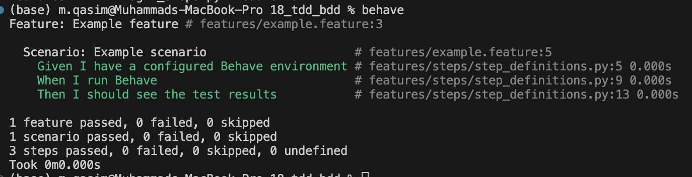

# TDD and BDD

## Learning References

[What is Behavior-Driven Development (BDD): A Complete Guide](https://www.lambdatest.com/learning-hub/behavior-driven-development)

[Advanced Guide to Behavior-Driven Development with Behave in Python](https://medium.com/@moraneus/advanced-guide-to-behavior-driven-development-with-behave-in-python-aaa3fa5e4c54)

[BDD as Evolved TDD](https://www.biteinteractive.com/bdd-as-evolved-tdd/)

[Behave Official Documentation](https://behave.readthedocs.io/en/latest/)

[ChatBDD: Using AI in a BDD Process](https://dev.to/richardforshaw/chatbdd-using-ai-in-a-bdd-process-1h6h)

[ChatTDD: Using AI as your Programming Buddy](https://dev.to/richardforshaw/chattdd-using-ai
-as-your-programming-buddy-4pd1)

**Test-Driven Development (TDD)** and **Behavior-Driven Development (BDD)** are both software development methodologies that emphasize the importance of testing, but they have different focuses and approaches. Here's a detailed explanation of each:

### Test-Driven Development (TDD)

**TDD** is a software development approach in which tests are written before writing the actual code. The process involves the following steps:

1. **Write a Test**: Before writing any functional code, the developer writes a test that defines a function or improvements to a function. The test is usually automated and designed to fail initially because the functionality it is testing does not yet exist.

2. **Run the Test**: The newly written test is run to check if it fails. This step ensures that the test is working correctly and that it will detect when the function is correctly implemented.

3. **Write the Code**: The developer then writes the minimal amount of code necessary to make the test pass. The focus is on getting the test to pass, rather than on other aspects of the code.

4. **Run All Tests**: All tests are run to ensure that the new code does not break any existing functionality.

5. **Refactor**: The code is then refactored to improve its structure and design while ensuring that all tests continue to pass. This step ensures that the codebase remains clean and maintainable.

6. **Repeat**: The cycle is repeated for each new feature or improvement.

**Advantages of TDD**:
- Ensures code correctness through frequent testing.
- Encourages better design and architecture.
- Provides a safety net for refactoring.
- Can lead to higher code quality and maintainability.

**Disadvantages of TDD**:
- Can be time-consuming to write tests for all functionalities.
- Requires a learning curve and discipline to implement effectively.
- Initial development may be slower.

### Behavior-Driven Development (BDD)

**BDD** extends TDD by emphasizing collaboration between developers, testers, and business stakeholders. It focuses on the behavior of the application and ensures that it meets business requirements. BDD uses natural language constructs (often English) to describe the tests. The process involves the following steps:

1. **Define Behavior**: Scenarios are written in a way that specifies the desired behavior of the application. These scenarios are usually written in a Given-When-Then format:
   - **Given**: Describes the initial context or state of the system.
   - **When**: Describes the action or event.
   - **Then**: Describes the expected outcome.

2. **Write Test Scenarios**: These scenarios are translated into automated tests. Tools like Cucumber, SpecFlow, or Behave are often used, which allow the scenarios to be written in plain language (e.g., Gherkin syntax).

3. **Run the Test**: The test is run to ensure it fails initially because the functionality is not yet implemented.

4. **Write the Code**: The developer writes the code to implement the required functionality.

5. **Run All Tests**: All tests are run to ensure the new code meets the defined behaviors and does not break existing functionality.

6. **Refactor**: The code is refactored to improve its structure while ensuring all tests pass.

7. **Repeat**: The cycle is repeated for each new feature or improvement.

**Advantages of BDD**:
- Enhances collaboration between developers, testers, and business stakeholders.
- Ensures that the software meets business requirements.
- Improves communication and understanding of requirements.
- Provides living documentation that is understandable by non-technical stakeholders.

**Disadvantages of BDD**:
- Can be challenging to write clear and concise scenarios.
- Requires a learning curve and discipline to implement effectively.
- May be seen as an overhead if not integrated into the development process correctly.

### Key Differences Between TDD and BDD

- **Focus**: TDD focuses on the implementation of functionality (writing tests first), while BDD focuses on the behavior and business value (defining the behavior first).
- **Communication**: BDD emphasizes collaboration and communication with non-technical stakeholders using natural language, whereas TDD is more developer-centric.
- **Tools and Syntax**: BDD often uses specific tools and syntax (like Gherkin) to write scenarios in plain language, whereas TDD uses unit testing frameworks like JUnit, NUnit, or pytest.

Both methodologies aim to improve software quality and ensure that the application meets its requirements, but they approach the problem from different angles and can often be used together to **complement each other**.

## Gherkin

**Gherkin** is a domain-specific language used in Behavior-Driven Development (BDD) for writing test scenarios that describe the expected behavior of software in a human-readable format. It allows non-technical stakeholders to understand and contribute to the creation of test cases, ensuring that the software meets business requirements.

### Key Features of Gherkin

1. **Human-Readable Syntax**: Gherkin uses plain language (often English) to describe scenarios, making it accessible to both technical and non-technical stakeholders.
2. **Given-When-Then Structure**: Gherkin scenarios follow a specific structure that helps in clearly defining the context, actions, and expected outcomes.

### Basic Syntax

Gherkin scenarios are written using a combination of keywords and natural language statements. The primary keywords are:

- **Feature**: A high-level description of a software feature.
- **Scenario**: A specific situation or use case to be tested.
- **Given**: The initial context or state before an action is taken.
- **When**: The action or event that triggers a response.
- **Then**: The expected outcome or result.
- **And** / **But**: Additional steps or conditions within Given, When, and Then.

### Example of Gherkin Syntax

Here’s an example of a Gherkin file for a simple login feature:

```gherkin
Feature: User Login

  Scenario: Successful login with valid credentials
    Given the user is on the login page
    When the user enters a valid username and password
    And the user clicks the login button
    Then the user should be redirected to the dashboard
    And the user should see a welcome message

  Scenario: Unsuccessful login with invalid credentials
    Given the user is on the login page
    When the user enters an invalid username or password
    And the user clicks the login button
    Then the user should see an error message indicating invalid credentials
```

### Gherkin in Practice

1. **Collaboration**: Gherkin enables collaboration between developers, testers, business analysts, and other stakeholders. By writing scenarios in plain language, everyone involved can understand the requirements and provide feedback.

2. **Automation**: Gherkin scenarios can be automated using BDD frameworks such as Cucumber, SpecFlow, or Behave. These tools parse Gherkin files and link them to corresponding test code, allowing the scenarios to be executed as part of the test suite.

3. **Living Documentation**: Gherkin scenarios serve as living documentation. They provide a clear and up-to-date reference for how the system is supposed to behave, which is useful for maintaining and evolving the software.

### Benefits of Using Gherkin

- **Clarity**: Provides a clear and concise way to describe software behavior, reducing misunderstandings.
- **Alignment**: Ensures that all stakeholders have a shared understanding of the requirements.
- **Test Coverage**: Encourages comprehensive testing by defining various scenarios, including edge cases.
- **Maintenance**: Scenarios written in Gherkin are easy to maintain and update as the system evolves.

### Challenges

- **Complexity**: Writing Gherkin scenarios for complex behaviors can be challenging and may require breaking down into multiple scenarios.
- **Discipline**: Requires discipline to keep scenarios focused and avoid over-complication.

### Conclusion

Gherkin is a powerful tool in the BDD toolkit, facilitating communication and collaboration among stakeholders and ensuring that software meets its intended behavior. By using Gherkin, teams can create clear, maintainable, and executable specifications that drive the development and testing of high-quality software.


## Best BDD framework for Python

Choosing the best BDD framework for Python depends on your specific needs, project requirements, team familiarity, and integration with other tools in your development pipeline. Here are some popular BDD frameworks for Python along with their features, advantages, and considerations:

### 1. Behave

**Behave** is one of the most widely used BDD frameworks for Python. It allows writing tests in a natural language style using Gherkin syntax.

#### Features:
- **Gherkin Syntax**: Uses Given-When-Then steps to describe behavior.
- **Integration**: Easily integrates with other Python testing tools and frameworks.
- **Community Support**: Well-documented and supported by a large community.

#### Advantages:
- **Readability**: Scenarios are easy to read and understand for both technical and non-technical stakeholders.
- **Ease of Use**: Simple to set up and use, with clear documentation.
- **Extensible**: Can be extended with plugins and custom step definitions.

#### Considerations:
- **Limited by Gherkin**: Some users may find Gherkin syntax limiting for complex test cases.

### 2. Lettuce

**Lettuce** is another BDD framework for Python that focuses on simplicity and ease of use. It also uses Gherkin syntax.

#### Features:
- **Gherkin Syntax**: Similar to Behave, it uses Given-When-Then steps.
- **Simplicity**: Designed to be simple and straightforward.

#### Advantages:
- **Ease of Use**: Very simple to set up and use, making it a good choice for smaller projects or teams new to BDD.
- **Focus on BDD**: Pure BDD focus without extra features that can complicate usage.

#### Considerations:
- **Less Active Development**: Compared to Behave, Lettuce has fewer updates and a smaller community.
- **Fewer Features**: Might lack some advanced features and integrations that larger projects require.

### 3. Pytest-BDD

**Pytest-BDD** combines the features of Pytest, a popular testing framework, with BDD capabilities. It allows you to write BDD-style tests using Gherkin syntax while leveraging the power of Pytest.

#### Features:
- **Gherkin Syntax**: Supports Given-When-Then steps.
- **Pytest Integration**: Full integration with Pytest, allowing you to use Pytest fixtures and plugins.
- **Flexibility**: Can mix and match traditional Pytest tests with BDD tests.

#### Advantages:
- **Powerful**: Leverages the full power of Pytest, including its extensive ecosystem of plugins.
- **Flexible**: Allows combining BDD and traditional testing styles.
- **Reusable Fixtures**: Use Pytest fixtures to manage setup and teardown code.

#### Considerations:
- **Complexity**: May have a steeper learning curve due to the combination of BDD and Pytest features.
- **Setup**: Requires understanding both Pytest and BDD paradigms.

### 4. Radish

**Radish** is a more advanced BDD framework for Python that extends Gherkin syntax with additional features, such as scenario loops and scenario preconditions.

#### Features:
- **Enhanced Gherkin**: Extends standard Gherkin syntax with additional constructs.
- **Advanced Features**: Supports more complex scenarios and testing needs.
- **Custom Step Parameters**: Allows more flexibility in defining steps.

#### Advantages:
- **Advanced Capabilities**: Suitable for complex projects that need more than standard Gherkin.
- **Flexibility**: Provides more tools to handle intricate test scenarios.

#### Considerations:
- **Complexity**: May be overkill for simpler projects or teams new to BDD.
- **Smaller Community**: Less widely used than Behave, meaning fewer resources and community support.

### Conclusion

- **For Simplicity and Wide Adoption**: **Behave** is often the best choice due to its balance of simplicity, features, and community support.
- **For Pytest Users**: **Pytest-BDD** is ideal if you are already using Pytest and want to integrate BDD into your existing test suite.
- **For Advanced Features**: **Radish** can be considered for projects requiring more advanced BDD features.
- **For Small Projects or Learning BDD**: **Lettuce** might be suitable due to its simplicity.

Ultimately, the best BDD framework for your project will depend on your specific requirements, existing toolchain, and the familiarity of your team with the frameworks.


## Using Gherkin in Behave

Gherkin is used in Behave, a popular BDD framework for Python. Behave allows you to write tests in a natural language style, using Gherkin syntax, which can be understood by non-technical stakeholders while being executable by the testing framework.

### How Behave Uses Gherkin

1. **Feature Files**: In Behave, test scenarios are written in Gherkin and stored in feature files. These files have a `.feature` extension and contain the high-level descriptions of features and scenarios.

2. **Step Definitions**: Behave maps the steps defined in Gherkin scenarios to Python functions. These functions contain the actual test code that will be executed.

### Example of a Behave Feature File

Here’s an example of a Gherkin feature file for a simple login feature:

```gherkin
Feature: User Login

  Scenario: Successful login with valid credentials
    Given the user is on the login page
    When the user enters a valid username and password
    And the user clicks the login button
    Then the user should be redirected to the dashboard
    And the user should see a welcome message

  Scenario: Unsuccessful login with invalid credentials
    Given the user is on the login page
    When the user enters an invalid username or password
    And the user clicks the login button
    Then the user should see an error message indicating invalid credentials
```

### Example of Step Definitions in Python

For the feature file above, you would write step definitions in Python to define what each step does:

```python
# features/steps/login_steps.py
from behave import given, when, then

@given('the user is on the login page')
def step_given_user_on_login_page(context):
    context.browser.get('https://example.com/login')

@when('the user enters a valid username and password')
def step_when_user_enters_valid_credentials(context):
    context.browser.find_element_by_name('username').send_keys('valid_user')
    context.browser.find_element_by_name('password').send_keys('valid_password')

@when('the user enters an invalid username or password')
def step_when_user_enters_invalid_credentials(context):
    context.browser.find_element_by_name('username').send_keys('invalid_user')
    context.browser.find_element_by_name('password').send_keys('invalid_password')

@when('the user clicks the login button')
def step_when_user_clicks_login_button(context):
    context.browser.find_element_by_name('login').click()

@then('the user should be redirected to the dashboard')
def step_then_user_redirected_to_dashboard(context):
    assert context.browser.current_url == 'https://example.com/dashboard'

@then('the user should see a welcome message')
def step_then_user_sees_welcome_message(context):
    welcome_message = context.browser.find_element_by_id('welcome').text
    assert welcome_message == 'Welcome, valid_user!'

@then('the user should see an error message indicating invalid credentials')
def step_then_user_sees_error_message(context):
    error_message = context.browser.find_element_by_id('error').text
    assert error_message == 'Invalid username or password.'
```

### Running the Tests

Once the feature files and step definitions are in place, you can run the tests using the `behave` command:

```sh
behave
```

This command will execute all the scenarios defined in your feature files, matching each step with the corresponding step definitions.

### Benefits of Using Behave with Gherkin

- **Readable Scenarios**: Gherkin syntax makes it easy to write and understand test scenarios, promoting collaboration between technical and non-technical team members.
- **Reusability**: Step definitions can be reused across multiple scenarios, reducing code duplication.
- **Automation**: Behave automates the execution of Gherkin scenarios, ensuring that your application behaves as expected.
- **Documentation**: Feature files serve as living documentation, providing a clear and up-to-date reference for the expected behavior of your application.

By using Gherkin with Behave, you can ensure that your tests are both human-readable and executable, bridging the gap between business requirements and technical implementation.

## BDD Effectiverness in Developing Conversational User Interfaces (CUI)

Yes, Behavior-Driven Development (BDD) can be very effective in developing applications with conversational user interfaces (CUI). Here are several reasons why BDD is particularly suitable for CUI development:

### 1. **Clear Requirements and Expectations**

BDD uses natural language to define the behavior of an application, which can be especially useful for CUIs. The Given-When-Then format allows developers, designers, and stakeholders to define conversational flows and interactions in a way that is easy to understand and validate.

**Example Scenario:**
```gherkin
Feature: Booking a Flight

  Scenario: User books a flight successfully
    Given the user is on the flight booking page
    When the user says "I want to book a flight to New York"
    Then the system should respond with "What dates would you like to travel?"
    And the user provides the dates
    Then the system should confirm the booking details
    And the user confirms
    Then the system should finalize the booking and respond with "Your flight to New York has been booked."
```

### 2. **Enhanced Collaboration**

BDD promotes collaboration between developers, testers, and non-technical stakeholders. In the context of CUIs, this means that product owners, conversation designers, and developers can work together to define the expected interactions and responses, ensuring that the user experience is well-aligned with business goals.

### 3. **Early Validation**

By defining behaviors before implementation, BDD allows for early validation of the conversational flows. Stakeholders can review the scenarios and provide feedback before any code is written, reducing the risk of misunderstandings and ensuring that the CUI meets user expectations.

### 4. **Automated Testing**

BDD frameworks like Cucumber, SpecFlow, or Behave can automate the testing of conversational scenarios. This ensures that as the CUI evolves, existing behaviors continue to work as expected, and new features can be added with confidence.

### 5. **Living Documentation**

BDD scenarios serve as living documentation for the CUI. They provide a clear and up-to-date reference for how the CUI should behave, which can be useful for onboarding new team members or revisiting the project after some time.

### 6. **Handling Variability in User Inputs**

CUIs often need to handle a wide range of user inputs and responses. BDD scenarios can capture this variability by defining different user paths and edge cases, ensuring that the CUI is robust and can handle unexpected interactions gracefully.

**Example Scenario with Variability:**
```gherkin
Feature: Handling Flight Booking Queries

  Scenario: User provides incomplete information
    Given the user is on the flight booking page
    When the user says "Book a flight"
    Then the system should respond with "Where would you like to fly to?"
    And the user provides the destination
    Then the system should respond with "What dates would you like to travel?"
    And the user provides incomplete or ambiguous dates
    Then the system should respond with "Could you please specify the dates more clearly?"
```

### Challenges and Considerations

- **Complexity of Conversations**: Defining complex conversational flows can be challenging and may require a lot of scenarios. It's important to keep scenarios concise and focused.
- **Natural Language Processing (NLP)**: CUIs rely heavily on NLP, which can be unpredictable. BDD scenarios need to account for variations in user input and potential misunderstandings.
- **Continuous Updating**: As user expectations and behaviors evolve, BDD scenarios need to be continuously updated to reflect these changes.

## Example:

1. **Create a Directory Structure**: Ensure that you have the correct directory structure for your Behave project. The typical structure is:

   ```
   your_project/
   ├── features/
   │   ├── steps/
   │   │   └── step_definitions.py
   │   └── your_feature_file.feature
   └── behave.ini (optional)
   ```

2. **Create the `steps` Directory**: Inside the `features` directory, create a subdirectory named `steps`. This is where your step definition files should reside.

   ```bash
   mkdir -p features/steps
   ```

3. **Add Step Definitions**: Inside the `steps` directory, add a Python file (e.g., `step_definitions.py`) and define your step functions there.

   ```python
   # features/steps/step_definitions.py

   from behave import given, when, then

   @given('I have a configured Behave environment')
   def step_impl(context):
       pass

   @when('I run Behave')
   def step_impl(context):
       pass

   @then('I should see the test results')
   def step_impl(context):
       pass
   ```

4. **Check `features` Directory**: Ensure that your `.feature` files are correctly placed in the `features` directory and are properly formatted.

   ```gherkin
   # features/example.feature

   Feature: Example feature

     Scenario: Example scenario
       Given I have a configured Behave environment
       When I run Behave
       Then I should see the test results
   ```

5. **Run Behave**: Navigate to the root of your project directory and run Behave again.

   ```bash
   behave
   ```



By ensuring that your project has the correct directory structure and that your `steps` directory contains the necessary step definition files, you should be able to resolve the "ConfigError: No steps directory" issue.

### Conclusion

BDD is effective for developing applications with conversational user interfaces because it aligns the development process with user and business expectations, promotes collaboration, and ensures thorough testing of conversational flows. By using BDD, teams can create more intuitive and reliable CUIs that meet the needs of their users.

## BBD and Designing Conversational AI

Behavior-Driven Development (BDD) can play a significant role in designing conversational AI by promoting a shared understanding of requirements between stakeholders, developers, and testers. BDD uses natural language descriptions to define the behavior of an application, which is particularly beneficial for conversational AI systems that need to handle complex, user-centric interactions. Here are several ways BDD can contribute:

### 1. **Improved Requirement Clarity**
BDD emphasizes writing requirements in a clear, concise, and executable format using Given-When-Then scenarios. This helps ensure that all stakeholders have a shared understanding of how the conversational AI should behave.

- **Example**:
  - **Given** a user asks for the weather forecast,
  - **When** the AI retrieves the weather data,
  - **Then** it should respond with the current weather conditions and the forecast for the next few days.

### 2. **User-Centric Design**
BDD encourages focusing on the end user's perspective, ensuring that the conversational flows are designed to meet user needs effectively.

- **Example**: By defining scenarios based on user stories, designers can ensure that the AI handles common user interactions smoothly, such as booking a flight or answering FAQs.

### 3. **Collaboration Across Teams**
BDD fosters collaboration among developers, testers, and non-technical stakeholders, such as business analysts and product owners. This collaborative approach helps identify and address potential issues early in the development process.

- **Example**: Regularly reviewing BDD scenarios in team meetings can ensure that the conversational AI's behavior aligns with business goals and user expectations.

### 4. **Automated Testing**
BDD scenarios can be directly translated into automated tests, which can continuously verify that the conversational AI behaves as expected as it evolves.

- **Example**: Tools like Cucumber or SpecFlow can be used to automate the Given-When-Then scenarios, ensuring that new features or changes do not introduce regressions.

### 5. **Documentation**
BDD scenarios serve as living documentation that remains relevant throughout the development lifecycle. This documentation is valuable for onboarding new team members and for maintaining the system.

- **Example**: The BDD scenarios provide a clear and up-to-date reference for how the conversational AI is supposed to handle various user interactions.

### 6. **Handling Edge Cases**
By defining scenarios for both common and edge cases, BDD helps ensure that the conversational AI can handle unexpected inputs gracefully.

- **Example**: Scenarios can be written to test how the AI handles ambiguous queries, incorrect data, or unsupported requests, ensuring robust error handling and fallback mechanisms.

### Implementing BDD in Conversational AI Development

1. **Define User Stories**: Collaborate with stakeholders to define user stories that capture the desired interactions with the conversational AI.
2. **Write BDD Scenarios**: Translate these user stories into Given-When-Then scenarios that describe the expected behavior.
3. **Develop and Test**: Implement the conversational AI features and use BDD tools to automate the testing of the scenarios.
4. **Review and Iterate**: Continuously review and update the scenarios to reflect changes in requirements or new insights gained from user feedback.

By incorporating BDD into the development process, teams can create conversational AI systems that are more reliable, user-friendly, and aligned with business objectives. This approach not only enhances the quality of the AI but also ensures that it meets the needs and expectations of its users.


## ChatBDD

ChatBDD is an approach that combines Behavior-Driven Development (BDD) with conversational AI, specifically leveraging the capabilities of language models like ChatGPT to enhance the BDD process. This method uses AI to help define, refine, and test behavior scenarios in natural language, facilitating better collaboration and understanding among stakeholders. Here’s a detailed explanation of ChatBDD and its components:

### 1. **Overview of ChatBDD**

ChatBDD integrates AI into the BDD workflow to:
- Generate and refine Given-When-Then scenarios.
- Automate the creation of example mappings and user stories.
- Facilitate continuous collaboration and feedback among team members.

### 2. **Components of ChatBDD**

#### **1. Scenario Generation**
ChatBDD utilizes AI to automatically generate behavior scenarios from user stories or high-level requirements. This helps in quickly creating a set of initial scenarios that can be further refined by the team.

- **Example**: If a user story states, "As a customer, I want to know the status of my order," the AI can generate scenarios like:
  - **Given** the user is logged into their account,
  - **When** they ask for the status of their order,
  - **Then** the system should display the current status of the order.

#### **2. Example Mapping**
Example Mapping is a technique used to explore and define detailed examples for each user story. In ChatBDD, AI assists in this process by providing suggestions and identifying potential edge cases.

- **Example**: For the user story about checking order status, the AI might suggest examples like checking the status for a pending order, a shipped order, and a delivered order.

#### **3. Refinement and Iteration**
The AI helps refine scenarios by identifying ambiguous or incomplete descriptions and suggesting improvements. This iterative process ensures that the scenarios are clear, testable, and aligned with the user requirements.

- **Example**: If a scenario lacks detail, the AI might prompt with questions like, "What should happen if the order status is unknown?" or "How should the system respond if the user is not logged in?"

### 3. **Benefits of ChatBDD**

#### **1. Enhanced Collaboration**
By providing a common language and understanding, ChatBDD fosters better communication among developers, testers, and business stakeholders. The AI-generated scenarios serve as a starting point for discussions, ensuring that everyone is on the same page.

#### **2. Increased Efficiency**
AI speeds up the scenario creation process, allowing teams to focus on refining and implementing the behavior rather than starting from scratch. This leads to faster development cycles and more thorough testing.

#### **3. Improved Quality**
Automated scenario generation and example mapping help in identifying edge cases and potential issues early in the development process, leading to higher quality software.

### 4. **Challenges of ChatBDD**

#### **1. Initial Setup and Learning Curve**
Adopting ChatBDD requires an initial investment in setting up the necessary tools and processes. Teams may also need to undergo training to effectively use AI in their BDD workflows.

#### **2. Dependence on AI Accuracy**
The effectiveness of ChatBDD depends on the accuracy and reliability of the AI. Inaccurate suggestions or scenarios can lead to misunderstandings and errors, so continuous monitoring and refinement are necessary.

### 5. **Tools and Frameworks for ChatBDD**

Several tools and frameworks can support ChatBDD by integrating AI capabilities with BDD processes:

- **Behave**: A popular BDD tool that can be extended with AI for generating and refining scenarios.
- **SpecFlow**: Another BDD tool that can benefit from AI-driven scenario creation and example mapping.
- **Custom Integrations**: Using APIs like OpenAI’s GPT-4, teams can build custom solutions to automate parts of the BDD process.

### Conclusion

ChatBDD represents an innovative fusion of AI and BDD, enhancing the development process through automation, collaboration, and improved scenario quality. By leveraging AI’s capabilities, teams can achieve greater efficiency and produce higher-quality software that meets user needs effectively.

## ChatBDD with Behave

Yes, you can use Behave as a tool for implementing ChatBDD. Behave is a popular Python-based BDD framework that uses plain language to describe the behavior of an application. Here’s how you can leverage Behave for ChatBDD:

### 1. **Overview of Behave**
Behave is a Python library that allows you to write tests in a natural language style using the Given-When-Then format. It is widely used for Behavior-Driven Development and supports creating automated acceptance tests.

### 2. **Integrating Behave with ChatBDD**

#### **1. Scenario Definition**
Use Behave to define scenarios that describe the expected behavior of your conversational AI. These scenarios should be written in plain English and follow the Given-When-Then format.

- **Example Scenario**:
  ```gherkin
  Feature: Order Status Inquiry
    Scenario: User asks for the status of their order
      Given the user is logged into their account
      When the user asks for the status of their order
      Then the system should display the current status of the order
  ```

#### **2. Generating Scenarios with AI**
You can use AI, such as OpenAI's GPT models, to generate initial scenarios from user stories. These scenarios can then be refined and implemented using Behave.

- **Example**: Use a GPT model to generate scenarios based on a user story like "As a customer, I want to know the status of my order." The AI can suggest scenarios which you can import into Behave.

#### **3. Example Mapping**
Incorporate Example Mapping sessions where stakeholders, developers, and testers collaborate to define detailed examples for each user story. These examples can then be translated into Behave scenarios.

- **Example**:
  ```gherkin
  Feature: Order Status Inquiry
    Scenario: User asks for the status of a pending order
      Given the user is logged into their account
      When the user asks for the status of their order
      Then the system should display "Your order is pending"
  ```

#### **4. Automated Testing**
Behave can automate the execution of these scenarios to verify that the conversational AI behaves as expected. This ensures that changes in the AI do not introduce regressions.

- **Example**:
  ```python
  from behave import given, when, then

  @given('the user is logged into their account')
  def step_given_user_logged_in(context):
      context.user_logged_in = True

  @when('the user asks for the status of their order')
  def step_when_user_asks_order_status(context):
      context.order_status = "pending"

  @then('the system should display "Your order is pending"')
  def step_then_system_displays_order_status(context):
      assert context.order_status == "pending"
  ```

### 3. **Benefits of Using Behave for ChatBDD**

#### **1. Enhanced Collaboration**
Behave’s natural language style allows non-technical stakeholders to participate in the scenario definition process, ensuring a shared understanding of requirements.

#### **2. Improved Efficiency**
Using AI to generate initial scenarios can save time, allowing the team to focus on refining and implementing these scenarios.

#### **3. Robust Testing**
Automated tests in Behave ensure that the conversational AI consistently behaves as expected, even as new features are added.

### 4. **Challenges and Considerations**

#### **1. Initial Setup**
Integrating AI with Behave requires some initial setup and configuration to ensure that the generated scenarios are correctly formatted and useful.

#### **2. Continuous Refinement**
Scenarios generated by AI might need refinement to ensure clarity and completeness. This requires continuous collaboration between team members.

### Conclusion
Behave can be effectively used as a tool for implementing ChatBDD, leveraging its BDD capabilities to define, refine, and automate tests for conversational AI. By integrating AI for scenario generation and using Behave for automation, you can create a robust and efficient workflow for developing conversational interfaces.


