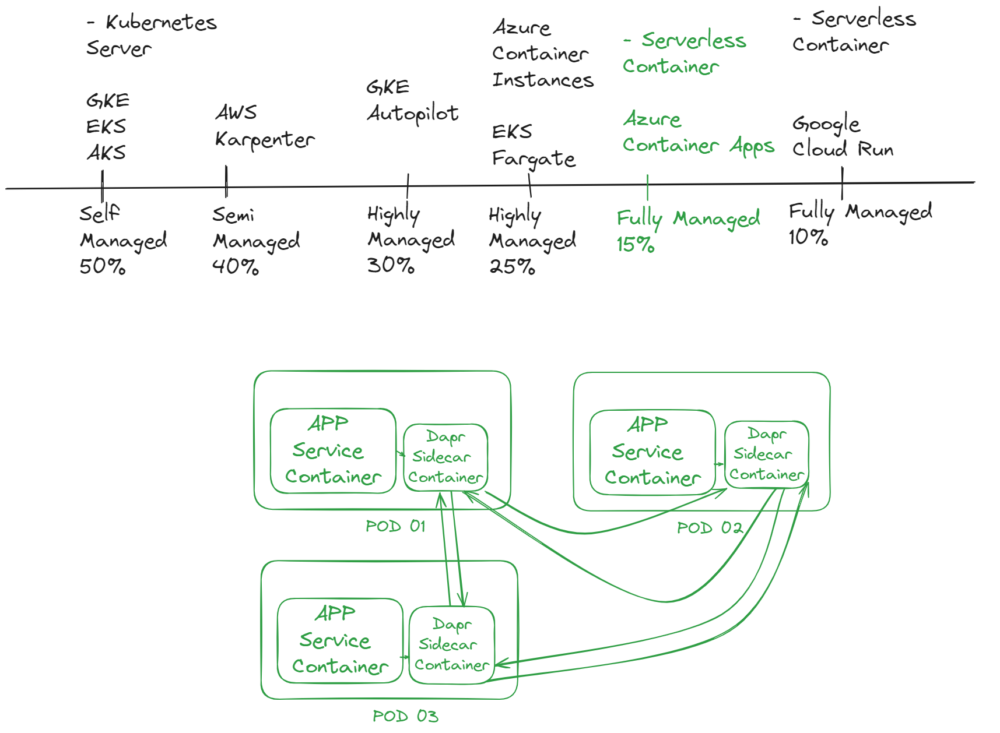

# Serverless Containers

Kubernetes is today's go-to platform for managing large groups of containers thanks to benefits such as faster development and release timelines, greater team productivity, reduced downtime risk, and easier troubleshooting with the rollback option.

However, because of its complexity, Kubernetes calls for in-house experts able to continuously manage and maintain the infrastructure, placing this solution out of reach for many smaller businesses.

A container orchestration solution brings together the benefits of serverless architecture and the quick performance of the container orchestration system Kubernetes. For example, Azure serverless containers allow cloud customers to run containers without the need for servers or system infrastructure.

That way, businesses can get containers up and running in minutes, with just enough flexibility to meet their needs. They also won’t have to worry about manual updates again.

Engineers can concentrate on their code while a third-party cloud provider provisions, maintains, and secures the hardware. You just pay for the compute resources you use, and the solution is more scalable and often less expensive than Kubernetes or traditional deployments.

## Adoption of Serverless Containers Continues to Increase

Serverless container adoption is on the rise—**46 percent** of container organizations now run serverless containers, up from 31 percent two years ago. It is being hypothesize that as organizations matured their container usage, many have adopted serverless containers as the next step in reducing operational overhead, increasing development agility, and lowering costs. Cloud providers fully provision and manage the infrastructure used by serverless containers, which enables teams to quickly launch new workloads while addressing the ongoing challenges of optimizing resource utilization.

Reference:

https://www.datadoghq.com/container-report/#1 

### Why Choose a Kubernetes-Powered Serverless Container Platform?

In the rapidly evolving landscape of cloud computing, companies are increasingly moving towards serverless containers due to their inherent flexibility, scalability, and cost-efficiency. Here’s why choosing a serverless container platform that is Kubernetes-powered provides the best of both worlds:

#### 1. **Scalability and Flexibility**
Kubernetes is renowned for its robust orchestration capabilities, allowing seamless scaling of applications based on demand. Serverless containers automatically scale resources up or down, enabling you to handle varying workloads without manual intervention. This ensures optimal performance and cost savings, as you only pay for what you use.

#### 2. **Operational Efficiency**
Kubernetes simplifies the deployment, management, and scaling of containerized applications. With a serverless approach, the operational overhead is further reduced because infrastructure management is abstracted away. This allows development teams to focus on writing code and delivering features rather than managing servers.

#### 3. **Cost Management**
Serverless containers eliminate the need for provisioning and maintaining servers, leading to significant cost savings. Kubernetes' efficient resource utilization combined with the pay-as-you-go model of serverless platforms ensures that you only incur costs for the resources actively in use, minimizing wastage.

#### 4. **Developer Productivity**
Kubernetes provides a consistent and predictable environment for deploying applications, which streamlines the development workflow. Serverless containers further enhance productivity by enabling rapid deployment and scaling of microservices without worrying about the underlying infrastructure.

#### 5. **Portability and Vendor Lock-In Avoidance**
Kubernetes is an open-source platform supported by all major cloud providers, offering a high degree of portability. This means you can run your Kubernetes-powered serverless containers on any cloud platform or on-premises infrastructure, avoiding vendor lock-in and ensuring flexibility in cloud strategy.

#### 6. **Built-in Features and Ecosystem**
Kubernetes has a rich ecosystem of tools and services for monitoring, logging, security, and CI/CD integration. Leveraging a serverless platform built on Kubernetes allows you to take advantage of these built-in features and integrations, providing a comprehensive solution for managing your containerized applications.

### Conclusion
Adopting a serverless container platform that is Kubernetes-powered offers the scalability, efficiency, and cost-effectiveness of serverless computing while retaining the powerful orchestration capabilities of Kubernetes. This approach ensures that you can handle dynamic workloads efficiently, reduce operational overhead, and enhance developer productivity, all while maintaining flexibility and avoiding vendor lock-in.

### Comparison of Kubernetes-Powered Services

#### 1. **Azure Container Apps**
- **Description**: Azure Container Apps is a serverless container platform that runs on Azure Kubernetes Service (AKS) under the hood. It provides fully managed Kubernetes with integrated Dapr, KEDA for event-driven scaling, and built-in support for microservices and containerized applications.
- **Management Level**: Highly Managed
- **Features**:
  - Serverless scaling
  - Built-in observability and security
  - Integrated with Azure ecosystem

#### 2. **GKE Autopilot**
- **Description**: GKE Autopilot is a fully managed mode of Google Kubernetes Engine that automates node management and maintenance. It abstracts away infrastructure management, focusing on application deployment and scaling.
- **Management Level**: Highly Managed
- **Features**:
  - Automated node provisioning and scaling
  - Integrated with Google Cloud services
  - Enhanced security and compliance

#### 3. **AWS Karpenter**
- **Description**: AWS Karpenter is an open-source, flexible, high-performance Kubernetes cluster auto-scaler built for Amazon EKS. It dynamically adjusts the size of your Kubernetes cluster based on the requirements of your workloads.
- **Management Level**: Semi-Managed
- **Features**:
  - Flexible, fast scaling
  - Integration with AWS services
  - Optimization for cost and performance

#### 4. **Google Cloud Run**
- **Description**: Google Cloud Run is a managed compute platform that automatically scales stateless containers. It runs on Google’s fully managed infrastructure, abstracting away Kubernetes complexities.
- **Management Level**: Fully Managed
- **Features**:
  - Serverless execution
  - Automatic scaling
  - Integrated with Google Cloud ecosystem

#### 5. **Native Kubernetes**
- **Description**: Native Kubernetes refers to running Kubernetes clusters directly without additional abstractions provided by cloud services. It requires more management effort but offers complete control over the environment.
- **Management Level**: Self-Managed
- **Features**:
  - Full control over infrastructure and configurations
  - Customizable to specific needs
  - Requires manual scaling, updates, and maintenance

## Pricing Table

|      Service         |            Example Cost Breakdown              |  Total (Approx.) |
|----------------------|:----------------------------------------------:|-----------------:|
| Google Cloud Run     | CPU: $2.4, Memory: $0.25, Requests: $0.40	    | ~$3.05           |
| Azure Container Apps | CPU: $1.4, Memory: $0.35, Requests: $0.20	    | ~$1.95           |
| GKE Autopilot	       | Cluster Fee: $72, CPU: $35.04, Memory: $29.20  | ~$136.24         |
| AWS Karpenter		     | EKS Cluster Fee: $72, EC2 Instance: $30.37	    | ~$136.24         |

**Notes:**
- Pricing is subject to change and may vary based on the region and specific usage patterns.
- Additional costs may apply for storage, networking, and other services not included in the examples.
- Always check the latest pricing on the respective cloud provider's pricing page for the most accurate and up-to-date information.

## Classification on the Spectrum of Managed Services

1. **Fully Managed Services**:
   - **Google Cloud Run**: Provides the highest level of abstraction and management, completely handling infrastructure for stateless containers.
   - **Azure Container Apps**: Offers serverless scaling and deep integration with Azure, simplifying container management.
   - **GKE Autopilot**: Automates most of the Kubernetes management tasks, focusing on application deployment and scalability.

2. **Semi-Managed Services**:
   - **AWS Karpenter**: While it automates scaling and integrates with AWS services, it still requires some management and configuration of the Kubernetes environment.

3. **Self-Managed Services**:
   - **Native Kubernetes**: Provides full control and flexibility, but requires significant management effort, including setup, scaling, updates, and maintenance.

### Summary

Choosing the right Kubernetes-powered platform depends on your needs for management and control. Fully managed services like Google Cloud Run, Azure Container Apps, and GKE Autopilot offer ease of use and scalability, ideal for teams focusing on application development without worrying about infrastructure. Semi-managed services like AWS Karpenter offer a balance, with some automation while allowing for more customization. Native Kubernetes provides maximum control and customization at the cost of increased management overhead.

