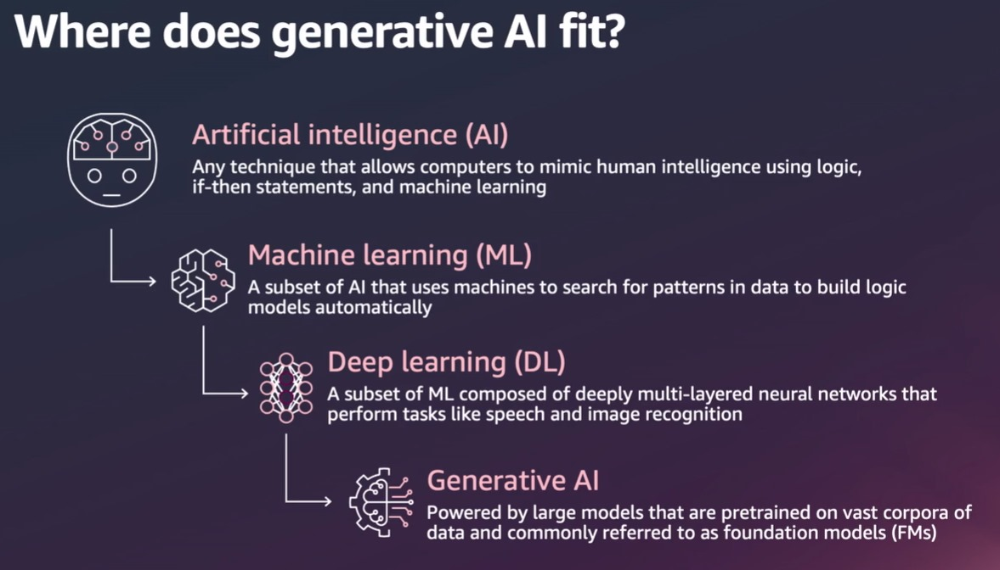
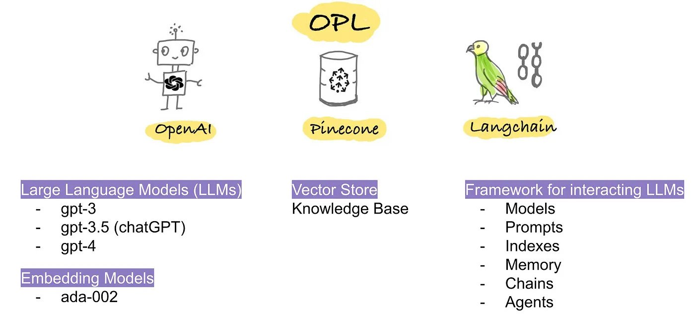

# Learn Generative AI

Before starting to learn from this repo [Learn Modern Python](https://github.com/panaverse/learn-modern-python)

## Introduction to Generative AI

[Watch Introduction to Generative AI](https://www.youtube.com/watch?v=G2fqAlgmoPo)

## What is the OPL stack in AI?

The OPL Stack stands for OpenAI, Pinecone, and Langchain. It's a collection of open-source tools and libraries that make building and deploying LLMs a breeze. 

## The Future of Generative AI

“AI will be the greatest wealth creator in history because artificial intelligence doesn’t care where you were born, whether you have money, whether you have a PhD,” Higgins tells CNBC Make It. “It’s going to destroy barriers that have prevented people from moving up the ladder, and pursuing their dream of economic freedom.”

It’s already valued at almost $100 billion, and expected to contribute $15.7 trillion to the global economy by 2030.

“It’s not that if you don’t jump on it now, you never can,” Higgins says. “It’s that now is the greatest opportunity for you to capitalize on it.”

[A.I. will be the biggest wealth creator in history](https://www.cnbc.com/2023/07/10/how-to-use-ai-to-make-money-right-now-say-experts.html)

[Generative AI could add up to $4.4 trillion annually to the global economy](https://www.zdnet.com/article/generative-ai-could-add-up-to-4-4-trillion-annually-to-global-economy/)

[Research Report](https://www.mckinsey.com/capabilities/mckinsey-digital/our-insights/the-economic-potential-of-generative-ai-the-next-productivity-frontier#key-insights)

[Silicon Valley Sees a New Kind of Mobile Device Powered by GenAI](
https://www.bloomberg.com/news/newsletters/2023-10-02/silicon-valley-sees-a-new-kind-of-mobile-device-powered-by-ai)

[Microsoft CEO: AI is "bigger than the PC, bigger than mobile" - but is he right?](https://www.techradar.com/computing/artificial-intelligence/microsoft-ceo-ai-is-bigger-than-the-pc-bigger-than-mobile-but-is-he-right)

[Artificial General Intelligence Is Already Here](https://www.noemamag.com/artificial-general-intelligence-is-already-here/)

[Inside the race to build an ‘operating system’ for generative AI](https://venturebeat.com/ai/inside-the-race-to-build-an-operating-system-for-generative-ai/)

## Generative BI

[Business intelligence in the era of GenAI](https://www.youtube.com/watch?v=m0-ul3O3GwA)

## Convergence of Generative AI and Web 3.0

[The Convergence of AI and Web3: A New Era of Decentralized Intelligence](https://medium.com/@dhruvil7694/the-convergence-of-ai-and-web3-a-new-era-of-decentralized-intelligence-ca86aef481d)

[What is the potential of Generative AI and Web 3.0 when combined?](https://blog.softtek.com/en/what-is-the-potential-of-generative-ai-and-web-3.0-when-combined)

[How Web3 Can Unleash the Power of Generative AI](https://www.linkedin.com/pulse/how-web3-can-unleash-power-generative-ai-iman-sheikhansari/)

## Text Books

1. [Generative AI with LangChain: Build large language model (LLM) apps with Python, ChatGPT and other LLMs](https://www.amazon.com/Generative-AI-LangChain-language-ChatGPT/dp/1835083463/ref=sr_1_3)
2. [LangChain Crash Course: Build OpenAI LLM powered Apps](https://www.amazon.com/LangChain-Crash-Course-powered-building-ebook/dp/B0CHHHX118/ref=sr_1_2)
3. [Build and Learn: AI App Development for Beginners: Unleashing ChatGPT API with LangChain & Streamlit](https://www.amazon.com/Build-Learn-Development-Beginners-Unleashing/dp/B0CDNNC5Z1/ref=sr_1_1)
4. [Generative AI in Healthcare - The ChatGPT Revolution](https://leanpub.com/generative-ai-in-healthcare)
5. [Generative AI in Accounting Guide: Explore the possibilities of generative AI in accounting](https://www.icaew.com/technical/technology/artificial-intelligence/generative-ai-guide)
6. [Using Generative AI in Business Whitepaper](https://resources.multiply.ai/en-gb/multiply-white-paper-chatgpt-and-generative-ai-download)
7. [Generative AI: what accountants need to know in 2023](https://www.amazon.com/Generative-AI-what-accountants-need/dp/B0CCL1P8XP)
8. [100 Practical Applications and Use Cases of Generative AI](https://ai.gov.ae/wp-content/uploads/2023/04/406.-Generative-AI-Guide_ver1-EN.pdf)

## Learn Langchain, Pinecone, and LLMs

[LangChain Explained in 13 Minutes | QuickStart Tutorial for Beginners](https://www.youtube.com/watch?v=aywZrzNaKjs)

[LangChain Crash Course for Beginners](https://www.freecodecamp.org/news/learn-langchain-for-llm-development/) 

[LangChain Crash Course for Beginners Video](https://www.youtube.com/watch?v=lG7Uxts9SXs)

[LangChain for LLM Application Development](https://www.deeplearning.ai/short-courses/langchain-for-llm-application-development/)

[LangChain: Chat with Your Data](https://www.deeplearning.ai/short-courses/langchain-chat-with-your-data/)

[A Gentle Intro to Chaining LLMs, Agents, and Utils via LangChain](https://towardsdatascience.com/a-gentle-intro-to-chaining-llms-agents-and-utils-via-langchain-16cd385fca81) 

[The LangChain Cookbook - Beginner Guide To 7 Essential Concepts](https://www.youtube.com/watch?v=2xxziIWmaSA&list=PLqZXAkvF1bPNQER9mLmDbntNfSpzdDIU5&index=4&t=1092s)

[Greg Kamradt’s LangChain Youtube Playlist](https://www.youtube.com/playlist?list=PLqZXAkvF1bPNQER9mLmDbntNfSpzdDIU5)

[1littlecoder LangChain Youtube Playlist](https://www.youtube.com/playlist?list=PLpdmBGJ6ELUK-v0MK-t4wZmVEbxM5xk6L)

Pinecone

https://docs.pinecone.io/docs/quickstart

https://python.langchain.com/docs/integrations/vectorstores/pinecone 

LangChain - Vercel AI SDK

https://sdk.vercel.ai/docs/guides/providers/langchain 

Using Python and Flask in Next.js 13 API

https://github.com/wpcodevo/nextjs-flask-framework

https://vercel.com/templates/python/flask-hello-world

https://vercel.com/docs/functions/serverless-functions/runtimes/python 

https://codevoweb.com/how-to-integrate-flask-framework-with-nextjs/#google_vignette 

https://github.com/vercel/examples/tree/main/python 

https://github.com/orgs/vercel/discussions/2732 

https://flask.palletsprojects.com/en/2.3.x/tutorial/

https://flask.palletsprojects.com/en/2.3.x/ 

Reference Material:
	
[LangChain Official Docs](https://python.langchain.com/docs/get_started/introduction)

[LangChain AI Handbook](https://www.pinecone.io/learn/series/langchain/)

[Top 5 Resources to learn LangChain](https://medium.com/@ankity09/top-5-resources-to-learn-langchain-e2bdbbd11702)

[Official LangChain YouTube channel](https://python.langchain.com/docs/additional_resources/youtube)

## Projects

[Building Custom Q&A Applications Using LangChain and Pinecone Vector Database](https://www.analyticsvidhya.com/blog/2023/08/qa-applications/)

[End to End LLM Project Using Langchain | NLP Project End to End](https://www.youtube.com/watch?v=MoqgmWV1fm8)

[Build and Learn: AI App Development for Beginners: Unleashing ChatGPT API with LangChain & Streamlit](https://www.amazon.com/Build-Learn-Development-Beginners-Unleashing/dp/B0CDNNC5Z1/ref=tmm_pap_swatch_0?_encoding=UTF8&qid=1695978776&sr=8-1) 

## Fundamentals of GenAI Quiz

Total Questions: 40

Duration: 60 minutes 

