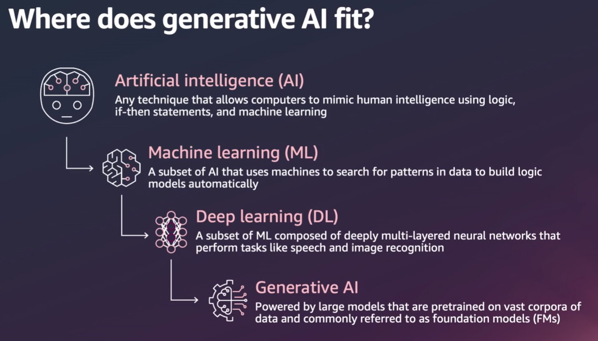
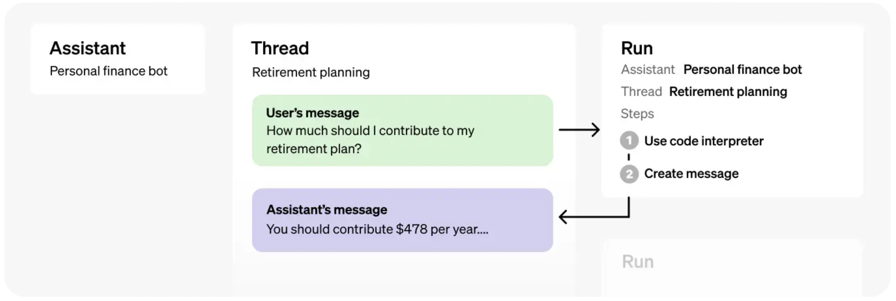
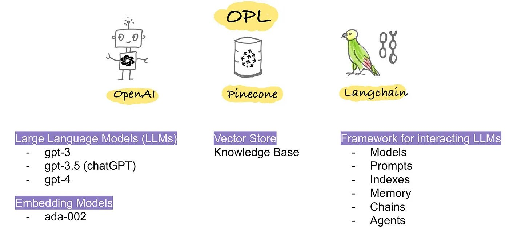

## Learn Cloud Applied Generative AI Engineering (GenEng)

### What This Course Covers
In this course, you'll learn how to build, deploy, and manage generative AI applications in the cloud with confidence. Whether it's text generation, image creation, or chat assistants, you'll develop the skills to make them scalable, reliable, and safe.

###  Course Roadmap

#### 1. Introduction & Setup
- Understand the course goals and requirements.
- Set up your cloud environment—no prior infra needed.

#### 2. Foundations of GenEng
- Explore how generative AI models work and how they behave differently in the cloud.
- Learn architecture best practices from small-scale prototypes to production-grade deployments.

#### 3. Hands-on: Model Training & Prompts
- Step into prompt engineering:
  - See examples like “Reverse-translate this phrase.”
  - Understand what makes a robust prompt—and how it can fail.
- Fine-tune models responsibly,
  - Learn about data splitting, overfitting, and alignment testing.

#### 4. Deploying to the Cloud
- Host your model using auto-scaled endpoints.
- Monitor in real time—set up alerts for usage spikes or performance dips.
- Optimize for latency and cost efficiency.

#### 5. Observability & Feedback
- Implement logging: request data, model outputs, error rates.
- Launch dashboards and analyze model drift over time.
- Build feedback loops to retrain and improve performance.

#### 6. Trust, Safety & Ethics
- Identify and reduce model biases.
- Design content filters and user safeguards.
- Learn access control and safe deployment strategies.

#### 7. Project-Based Learning
- Complete labs for mini-tools like chatbots or generators.
- Build a capstone: bring it all together from data intake to user interface.

#### 8. Closing & What’s Next
- Reflect on your accomplishments: scalable deployments, dashboards, safe models.
- Dive into advanced paths: multi-modal models, secure pipelines, or generative AI ops.

---

### Tips for Learners
| Tip | Why It Matters |
|-----|----------------|
| Start small: test locally before scaling. | Bounce fast and avoid expensive mistakes. |
| Keep logs early. | Observability prevents surprises in production. |
| Defense in depth: design with misuse in mind. | Trustworthy systems start with thoughtful architecture. |

---

# ☁️ Cloud Accounts Setup Guide  

Welcome to the project! 🚀  
Before we begin, it’s important that **all faculty members and students** set up their cloud accounts. Cloud platforms such as **Microsoft Azure**, **Google Cloud**, and others provide the tools, credits, and AI services we’ll be using throughout this course/project.  

By registering, you’ll gain access to:  
- Free credits for experimenting with **AI and cloud services**  
- Hands-on experience with **industry-standard platforms**  
- Tools required for assignments, projects, and demonstrations  
- Secure cloud environments for deploying applications  

Without these accounts, you won’t be able to access the resources needed for labs and practical tasks.  

---

## 🌐 Required Cloud Accounts  

### 1️⃣ Microsoft Azure Account  

Microsoft Azure provides cloud computing services and access to **Azure OpenAI Service**, which allows you to use AI models for projects and learning.  

**Steps to Register:**  
1. Navigate to the official registration page:  
   👉 [Microsoft Azure Free AI Services](https://azure.microsoft.com/en-us/free/ai-services/)  
2. Sign up using your **company/educational email**.  
3. After registering, note down your **Subscription ID**—you’ll need it later to activate Azure AI services.  
4. Apply for the **Azure OpenAI Service**:  
   👉 [Azure OpenAI Service](https://azure.microsoft.com/en-us/products/ai-services/openai-service)  

---

### 2️⃣ Google Cloud Account  

Google Cloud offers a generous free tier that includes both **$300 in credits** and numerous always-free services across platforms like Compute Engine and BigQuery.  

**Steps to Register:**  
1. Visit the official signup page:  
   👉 [Google Cloud Free Account](https://cloud.google.com/free)  
2. Sign up using your **Google or institutional email**.  
3. Verify your identity (a card may be required, but you won’t be charged unless you exceed free credits).  
4. Once validated, you'll receive **$300 in free credit** and access to always-free products.  

---

## 🌐 Additional Recommended Cloud Accounts  

### 3️⃣ Amazon Web Services (AWS)  

AWS offers **12 months of free services**, including EC2, S3, and Lambda.  
👉 [AWS Free Tier](https://aws.amazon.com/free/)  

**Steps to Register:**  
1. Go to the official AWS signup page.  
2. Click on **Create a Free Account**.  
3. Enter your email address and set a secure password.  
4. Provide contact details and **billing information** (a credit/debit card is required but you won’t be charged if you stay within the free tier).  
5. Choose the **Free Tier plan** and complete verification.  
6. Once verified, log in to the **AWS Management Console** to start exploring services.  

---

### 4️⃣ IBM Cloud  

IBM Cloud provides **$200 free credits** to explore AI, Kubernetes, and cloud hosting solutions.  
👉 [IBM Cloud Free Account](https://www.ibm.com/cloud/free)  

**Steps to Register:**  
1. Visit the IBM Cloud signup page.  
2. Click **Create a Free Account**.  
3. Sign up using your email or **single sign-on (Google/LinkedIn/IBM ID)**.  
4. Verify your account with a confirmation email.  
5. Once registered, you’ll receive **$200 free credits** to use within the first 30 days.  

---

### 5️⃣ Oracle Cloud Infrastructure (OCI)  

Oracle Cloud provides an **Always Free Tier**, including **2 autonomous databases, compute, storage, and AI tools**.  
👉 [Oracle Cloud Free Tier](https://www.oracle.com/cloud/free/)  

**Steps to Register:**  
1. Open the Oracle Cloud Free Tier signup page.  
2. Click **Start for Free**.  
3. Provide your personal details and a valid email.  
4. Enter **payment verification details** (a card is required but won’t be charged for free tier usage).  
5. Verify your identity via email and phone.  
6. Once approved, log in to access Always Free services.  

---

### 6️⃣ DigitalOcean  

DigitalOcean is simple and developer-friendly, offering **$200 in free credits for 60 days**.  
👉 [DigitalOcean Free Trial](https://try.digitalocean.com/freetrialoffer/)  

**Steps to Register:**  
1. Go to the DigitalOcean free trial page.  
2. Click **Sign Up**.  
3. Register using your email, Google, or GitHub account.  
4. Provide payment details (credit card or PayPal) for verification.  
5. Once verified, you’ll receive **$200 credits valid for 60 days**.  
6. Access your **DigitalOcean Dashboard** to create virtual machines (Droplets), databases, or apps.  

---

### Notes :

- Start with **Azure + Google Cloud** (mandatory for this course/project).  
- Explore **AWS, IBM, Oracle, and DigitalOcean** for extra practice.  
- Most platforms provide **free credits or always-free tiers**—avoid exceeding free limits to prevent charges.  
- Save all your **login credentials, subscription IDs, and usage details** safely.
  
---

# 🌍 The New Era of AI  

Artificial Intelligence is not just evolving—it’s rapidly becoming the **foundation of innovation, productivity, and human creativity**. From powering search engines and healthcare diagnostics to driving self-driving cars and personalized education, AI is quietly reshaping nearly every aspect of our daily lives.  

We are living in a time where algorithms can **learn, reason, and create**. Unlike earlier technological waves, AI doesn’t just enhance efficiency—it changes how humans think, work, and interact with machines. This era is defined by **generative models**, **autonomous decision-making systems**, and **intelligent assistants** that blur the line between human capability and machine intelligence.  

Yet, alongside opportunity comes responsibility. Questions around **ethics, data privacy, bias, and regulation** are more pressing than ever. As AI systems scale into critical infrastructure, businesses, and education, society must strike a balance between innovation and accountability.  

The "New Era of AI" isn’t just about smarter technology—it’s about redefining **how we live, work, and imagine the future**. Below you’ll find curated articles, a timeline of milestones, and a visual journey to understand how far AI has come and where it’s headed.  

---

## 🔗 Featured Articles  

**. [From Microsoft to MIT MBA: The AI Boot Camp for Every Worker and Executive](https://www.cnbc.com/2023/12/15/from-microsoft-to-mit-mba-an-ai-boot-camp-for-every-worker-executive.html)  

**. [The Age of AI Has Begun – Bill Gates](https://www.gatesnotes.com/The-Age-of-AI-Has-Begun)  

**. [Nvidia Says Generative AI Will Be Bigger Than the Internet](https://www.theverge.com/2023/11/15/23962497/nvidia-says-generative-ai-will-be-bigger-than-the-internet)  

**. [Generative AI and Its Economic Impact: What You Need to Know](https://www.investopedia.com/economic-impact-of-generative-ai-7976252)  

**. [OpenAI DevDay: A Pivotal Moment for AI](https://www.aitidbits.ai/p/openai-devday)  

**. [Forget Rows About Interest Rates — We Should Watch Out for AI](https://www.thetimes.co.uk/article/forget-rows-about-interest-rates-we-should-watch-out-for-ai-vmcxqcdx2)  

**. [Deep Analysis Reveals AI's Impact on Australian Tech Jobs](https://www.news.com.au/finance/work/deep-analysis-reveals-ais-impact-on-australian-tech-jobs/news-story/778d8217d588db44126b37529f0a499f)  

**. [The Hidden Economics of AI: Balancing Innovation with Reality](https://www.techradar.com/pro/the-hidden-economics-of-ai-balancing-innovation-with-reality)  

**. [How 'Altman's Pause' Could Knock the AI Industry Off Course](https://www.washingtonpost.com/opinions/2025/08/13/chatgpt-altman-openai-ai-slowdown)  

**. [AI-Generated Wealth Could Be the Future, Predicts Sam Altman](https://economictimes.indiatimes.com/magazines/panache/ai-generated-wealth-could-be-the-future-predicts-openais-sam-altman-as-society-gets-richer-/articleshow/123306824.cms)  

**. [CFOs Were Skeptical… But They've Changed Their Tune Since the Arrival of Agents](https://www.itpro.com/business/business-strategy/cfos-were-skeptical-about-ai-investment-but-theyve-changed-their-tune-since-the-arrival-of-agents)  

---

## ⏳ AI Milestones Timeline  

- **1956** – Term *Artificial Intelligence* coined at the Dartmouth Conference.  
- **1997** – IBM’s *Deep Blue* defeats world chess champion Garry Kasparov.  
- **2011** – IBM’s *Watson* wins Jeopardy! against human champions.  
- **2016** – Google DeepMind’s *AlphaGo* beats Go champion Lee Sedol.  
- **2022** – *ChatGPT* launches, making AI mainstream for everyday users.  
- **2023** – Generative AI explodes; OpenAI, Anthropic, Google, and Microsoft dominate.  
- **2025** – AI agents emerge, CFOs and leaders adopt agentic AI for cost savings & innovation.  

---

## 📊 Infographic Overview (Interactive Concept)  

We’re designing a **living infographic** — a dynamic knowledge map that evolves as AI research, adoption, and policy milestones unfold.  
Rather than a static chart, this will be an **ever-growing hub** that readers can explore and interact with.  

---

### 🔹 Core Features  

**🕒 Timeline Explorer**  
- A scrolling timeline highlighting major **AI milestones** (research, startups, ethics, policy).  
- Expandable cards with context, related articles, videos, and external datasets.  
- Color-coded categories: *Research*, *Business*, *Ethics/Policy*, *Society*.  

---

**🌍 Global Adoption Map**  
- Interactive map where regions glow based on **AI adoption intensity**.  
- Toggle views: *Investment*, *Policy*, *Education*, *Industry Use*.  
- Regional drill-downs with key projects, government strategies, and local startups.  

---

**📈 Sector Impact Dashboard**  
- Charts showing AI’s effect across: **Education, Healthcare, Business, Entertainment, Defense, Arts, Governance**.  
- Each sector links to **case studies, video explainers, and policy insights**.  
- Comparative view: how adoption differs across regions and years.  

---

**💰 Investment Flow Tracker**  
- Flow-style diagram tracing AI capital:  
  - Sources: Governments, Big Tech, Venture Capital  
  - Destinations: Research, Startups, Cloud Platforms, Ethics Initiatives  
- Updates with **real-time funding announcements** and IPOs.  

---

**🧭 Policy & Ethics Monitor**  
- A dynamic tracker for global regulations and ethical debates.  
- Timeline of policies (EU AI Act, U.S. guidelines, China’s AI Strategy).  
- Filters: *Data Privacy*, *Bias & Fairness*, *AI Safety*.  

---

**🧠 Skills & Workforce Map**  
- Tracks how AI adoption reshapes **jobs and required skills**.  
- Heatmap of in-demand skills: Prompt Engineering, Data Ethics, AI Ops.  
- Career pathways and training resources linked for developers, students, and policymakers.  

---

**🎨 Cultural & Creative Impact Wall**  
- Showcases AI-driven art, music, storytelling, and gaming.  
- Interactive gallery where users can explore generative AI creations.  
- Debate section: “Is AI creative?” → collects expert & public opinions.  

---

**📊 Future Forecast Simulator**  
- Users can toggle projections: *Optimistic*, *Balanced*, *Critical*.  
- Predicts AI adoption effects on GDP, jobs, education, and innovation.  
- Scenario storytelling: “What might 2035 look like under rapid AI acceleration?”  

---

### 🔹 Layout Vision  

- **Left Panel:** Timeline + Policy Monitor  
- **Center:** World Map + Future Forecast Simulator  
- **Right Panel:** Sector Dashboard + Investment Flow + Skills Tracker  
- **Footer:** Cultural Wall + Links to new research/articles  

---

### 🔹 Growth Plan  

1. **Phase 1** – Timeline + simple sector chart.  
2. **Phase 2** – Global map + investment tracker.  
3. **Phase 3** – Ethics/Policy Monitor + Workforce Skills Map.  
4. **Phase 4** – Cultural Impact + Forecast Simulator.  
5. **Phase 5** – Continuous updates → making it a **living AI knowledge hub**.  

---

# Generative Engineering (GenEng)

Generative Engineering (GenEng) is a revolution being led by developers who build deep proficiency in how to best leverage and integrate generative AI technologies into applications.

There is a clear separation of roles between those that create and train models (Data Scientists and Engineers) and those who use those models (Developers). This was already underway, and it is now much clearer with the Generative AI revolution. The future of GenAI will be determined by how it will be driven to adoption — and it will be developers who push that adoption forward.

GenEng practitioners will need to have many of the same skills of traditional application development, including:
- Scalable architecting  
- Integrating enterprise systems  
- Understanding requirements from the business user  

These will be augmented with new skills for building GenAI applications, such as:
- Involving business domain experts in validating aspects of prompt engineering  
- Choosing the right LLM based on price, performance, and outcomes  

[The rise of GenEng: How AI changes the developer role](https://cloud.google.com/blog/products/ai-machine-learning/the-rise-of-geneng-how-ai-changes-the-developer-role)  
[Watch: The Rise of GenEng](https://www.youtube.com/watch?v=RLUrvgfEeUc)

---

## 📚 Additional Reads & Videos on Generative Engineering (GenEng)

### 🔹 Articles & Insights
- **More than coders: developers as business enablers**  
  How generative AI and low-code tools are transforming developers into strategic business enablers.  
  [Read on TechRadarPro](https://www.techradar.com/pro/more-than-coders-developers-as-business-enablers?utm_source=chatgpt.com)

- **From Dev Speed to Business Impact: The Case for AI-Assisted Coding and GenEng** (BCG X)  
  Real-world stats: Google, Microsoft, and others are seeing 30–100× efficiency gains through GenEng.  
  [Read on BCG](https://www.bcg.com/x/the-multiplier/ai-assisted-coding-generative-engineering?utm_source=chatgpt.com)

- **Why developers and their bosses disagree over generative AI** (LeadDev)  
  A thoughtful look at the cultural shifts needed for AI to be a true development partner.  
  [Read on LeadDev](https://leaddev.com/ai/why-developers-and-their-bosses-disagree-over-generative-ai?utm_source=chatgpt.com)

- **A Brave New (Generative) World – The future of generative software engineering** (Capgemini)  
  Visions of self-evolving software systems and the rise of AI-orchestrated development.  
  [Read on Capgemini](https://www.capgemini.com/gb-en/insights/expert-perspectives/a-brave-new-generative-world-the-future-of-generative-software-engineering/?utm_source=chatgpt.com)

- **AI is reshaping Wall Street tech jobs...** (Business Insider)  
  Insider advice from financial tech leaders on how developers must evolve business thinking alongside AI skills.  
  [Read on Business Insider](https://www.businessinsider.com/wall-street-software-engineers-ai-career-advice-finance-technologists-2025-4?utm_source=chatgpt.com)

---

### 🎓 Webcasts & Education
- **Generative AI and Software Engineering Education** (SEI, CMU)  
  How GenAI tools are being integrated into software engineering curricula.  
  [Watch here](https://www.sei.cmu.edu/library/generative-ai-and-software-engineering-education/?utm_source=chatgpt.com)

- **The Future of Software Engineering and Acquisition with Generative AI** (SEI, CMU)  
  Calls for combining generative innovation with trust and security in engineering workflows.  
  [Watch here](https://www.sei.cmu.edu/library/the-future-of-software-engineering-and-acquisition-with-generative-ai/?utm_source=chatgpt.com)

---

### 🎥 Video Picks
- [Generative AI In Software Development – YouTube](https://www.youtube.com/watch?v=bd505-daMrw&utm_source=chatgpt.com)  
- [Generative AI for Developers – Comprehensive Course](https://www.youtube.com/watch?v=F0GQ0l2NfHA&utm_source=chatgpt.com)  
- [Generative AI in a Nutshell – How to survive and thrive in the age of AI](https://www.youtube.com/watch?v=2IK3DFHRFfw&utm_source=chatgpt.com)

---

# 📰 Latest News

[Google launches its largest and ‘most capable’ AI model, Gemini](https://www.cnbc.com/2023/12/06/google-launches-its-largest-and-most-capable-ai-model-gemini.html)  
Google unveiled **Gemini**, its biggest and most advanced AI model, designed to compete with OpenAI’s GPT-4 and push multimodal AI boundaries.  

[Meta, IBM and Intel join alliance for open AI development while Google and Microsoft sit out](https://www.scmp.com/tech/big-tech/article/3244012/meta-ibm-and-intel-join-alliance-open-ai-development-while-google-and-microsoft-sit-out)  
A new alliance for **open AI development** has been formed, highlighting growing divides among tech giants on how AI should evolve.  

[What Elon Musk has said about Ilya Sutskever, the chief scientist at the center of OpenAI’s leadership upheaval](https://finance.yahoo.com/news/elon-musk-said-ilya-sutskever-171726023.html)  
Elon Musk commented on Ilya Sutskever’s role during OpenAI’s leadership crisis, sparking debate on **ethics and loyalty in AI research**.  

[Who is OpenAI chief scientist Ilya Sutskever, and what does he think about the future of AI and ChatGPT?](https://www.fastcompany.com/90985752/ilya-sutskever-openai-chief-scientist)  
An inside look at **Ilya Sutskever**, his vision for the future of AI, and his pivotal role at OpenAI.  

[Sam Altman to return as CEO of OpenAI](https://www.theverge.com/2023/11/22/23967223/sam-altman-returns-ceo-open-ai)  
After dramatic boardroom events, **Sam Altman** is reinstated as OpenAI’s CEO, stabilizing leadership and investor trust.  

[Microsoft introduces AI-powered Windows features in 2025 update](https://www.theverge.com/2025/2/20/microsoft-windows-ai-features-update)  
Microsoft announced a major Windows update featuring **AI copilots**, productivity boosters, and system-wide generative tools.  

[Anthropic launches Claude 3 with improved reasoning capabilities](https://techcrunch.com/2025/03/05/anthropic-launches-claude-3-ai)  
Anthropic unveiled **Claude 3**, its most advanced AI assistant, focusing on safety, reasoning, and enterprise use cases.  

[China releases new AI regulations to ensure “safe innovation”](https://www.reuters.com/technology/china-new-ai-regulations-2025-04-10)  
China rolled out updated **AI regulatory frameworks**, emphasizing both innovation and security, impacting global AI policy.  

[AI helps discover new antibiotics to fight superbugs](https://www.bbc.com/news/science-environment-68891234)  
Researchers used AI to identify **novel antibiotics**, marking a breakthrough in the battle against drug-resistant bacteria.  

[OpenAI and Apple rumored to collaborate on AI for iPhone](https://www.bloomberg.com/news/articles/2025-05-12/openai-apple-ai-iphone-collaboration)  
Reports suggest **OpenAI and Apple** are exploring an integration to bring advanced AI features natively to iPhones.  

## 💼 Technology from the Business and Top Management Perspective  

### 📘 Featured Reports & Insights  

[The Year in Tech, 2024: The Insights You Need from Harvard Business Review](https://www.hbsp.harvard.edu/product/10673-PDF-ENG)  
Harvard Business Review’s "Year in Tech 2024" explores the strategic implications of **Generative AI, Web 3.0, automation, and data-driven innovation**. It helps executives understand not only what the latest technological shifts mean for their industry but also how to **reimagine operations, strategy, and leadership models** in response to them. It emphasizes the urgency of adaptation in a turbulent environment, warning that companies who fail to embrace these shifts risk losing their competitive edge.  

[McKinsey Technology Trends Outlook 2023](https://www.mckinsey.com/capabilities/mckinsey-digital/our-insights/the-top-trends-in-tech#new-and-notable)  
McKinsey’s annual outlook identifies **14 major technology trends**, with AI and machine learning dominating across industries. The report highlights **generative AI’s role in productivity, cloud scalability, digital trust architectures, and industrial automation**. Business leaders are urged to think beyond hype, focusing instead on capability building, responsible deployment, and ROI measurement.  

[BCG: How Business Leaders Can Unlock Value with Generative AI](https://www.bcg.com/publications/2023/how-business-leaders-can-unlock-value-with-generative-ai)  
Boston Consulting Group outlines how generative AI is reshaping **customer engagement, decision-making, and creative processes**. It provides case studies of companies that achieved **30–50% productivity gains** by carefully integrating AI into workflows. The report emphasizes **strategic alignment** between AI initiatives and business goals.  

[Gartner Top Strategic Technology Trends for 2024](https://www.gartner.com/en/articles/gartner-top-strategic-technology-trends-for-2024)  
Gartner identifies **AI-augmented development, platform engineering, industry cloud platforms, and machine customers** as central to shaping business models. These trends are not just about technology adoption but about transforming **business ecosystems, value delivery, and competitive dynamics**.  

[Forbes: How AI is Reshaping Business Strategy in 2024](https://www.forbes.com/sites/forbestechcouncil/2024/01/05/how-ai-is-reshaping-business-strategy-in-2024/)  
Forbes discusses how executives are moving from **experimental AI adoption** to **enterprise-wide integration**, using AI for predictive insights, customer personalization, and operational efficiency. It stresses the importance of **governance, transparency, and workforce upskilling**.  

[Bain & Company: The CEO’s Guide to AI Transformation](https://www.bain.com/insights/ceos-guide-to-ai-transformation/)  
Bain provides a practical framework for CEOs to **navigate AI transformation**—from identifying the right use cases to scaling responsibly across the enterprise. It focuses on how AI can reshape **supply chains, finance functions, and market entry strategies**.  

---

### 📖 Expanded Perspective  

From the **executive and top-management viewpoint**, technology is no longer a back-office enabler but a **boardroom priority** that directly impacts growth, risk, and survival. Across Harvard, McKinsey, BCG, Bain, Gartner, and Forbes, a consistent theme emerges:  

- **AI as a Core Strategic Lever** – Generative AI is reshaping industries by automating creativity, decision-making, and innovation pipelines. Leaders are urged to rethink **how they create value** and move from experimentation to scaled adoption.  
- **Tech-Driven Business Models** – Cloud, AI, and Web 3.0 are spawning new **ecosystem-based models** that shift competitive dynamics, requiring agility in partnerships and collaborations.  
- **Resilience and Trust** – With data breaches, misinformation, and regulatory scrutiny growing, **responsible AI** and digital trust frameworks are highlighted as non-negotiables.  
- **Leadership & Workforce Readiness** – Reports stress that **human capital transformation**—upskilling teams to collaborate with AI—will be as critical as adopting the tech itself.  
- **Investment Priorities** – Business leaders are expected to focus on **AI infrastructure, cybersecurity, and sustainability tech** as pillars of long-term competitiveness.  

In summary, the world’s top strategy and management consultancies agree: **AI and digital innovation are not optional experiments—they are defining the next era of corporate strategy.** The companies that thrive will be those who **align leadership vision, workforce readiness, and responsible innovation** into one cohesive roadmap.  

## 🎥 Introduction to Generative AI  

[▶️ Watch: Introduction to Generative AI](https://www.youtube.com/watch?v=G2fqAlgmoPo)  

Generative AI refers to a class of artificial intelligence systems that can **generate new content**, such as text, images, code, music, or video, based on the data they have been trained on. Unlike traditional AI models that classify or predict, generative AI is **creative in nature**, making it a transformative force across industries.  

It is being adopted in areas such as:  
- **Business & Marketing**: Content generation, personalized recommendations, campaign design.  
- **Education & Research**: Automating learning materials, aiding scientific discovery.  
- **Healthcare**: Drug discovery, medical imaging, personalized patient care.  
- **Technology Development**: Code generation, simulation, and product design.  

Generative AI is not just a tool but a **paradigm shift** that redefines the way humans and machines collaborate.  

  

## 📈 Generative AI and the Economy  

Generative AI is not just transforming technology—it is reshaping the global **economy, productivity, and labor markets**. Analysts, researchers, and consulting firms project massive shifts in how work is organized, value is created, and industries evolve. Below are some key reports and studies highlighting the economic impact:  

1. [McKinsey: *The economic potential of generative AI: The next productivity frontier*](https://www.mckinsey.com/capabilities/mckinsey-digital/our-insights/the-economic-potential-of-generative-ai-the-next-productivity-frontier#introduction)  
   *McKinsey Digital Report, June 2023*  
   - Estimates generative AI could add **$2.6 to $4.4 trillion annually** across industries.  
   - Major impact expected in **customer operations, marketing & sales, software development, and R&D**.  

2. [*GPTs are GPTs: An Early Look at the Labor Market Impact Potential of Large Language Models*](https://arxiv.org/pdf/2303.10130.pdf)  
   *Tyna Eloundou, Sam Manning, Pamela Miskin, and Daniel Rock, March 2023 (arXiv:2303.10130)*  
   - Explores how large language models (LLMs) may affect job tasks.  
   - Suggests around **80% of U.S. workers** could see at least 10% of their work tasks influenced by LLMs.  
   - Highlights both opportunities for augmentation and risks of displacement.  

3. [Goldman Sachs: *The Potentially Large Effects of Artificial Intelligence on Economic Growth*](https://www.gspublishing.com/content/research/en/reports/2023/03/27/d64e052b-0f6e-45d7-967b-d7be35fabd16.html)  
   *Joseph Briggs and Devesh Kodnani, March 2023*  
   - Predicts AI could raise global GDP by **7% (≈ $7 trillion)** over the next decade.  
   - Suggests productivity gains could rival those of the **industrial revolution**.  
   - Discusses job displacement but also the creation of entirely new categories of work.  

Generative AI’s impact on the economy will depend on **adoption speed, regulation, workforce adaptation, and ethical safeguards**. While the potential for growth is huge, so are the challenges of managing disruption.  

## 🤖 "ChatGPT API" (Correctly: OpenAI API)  

The **OpenAI API** is a collection of powerful APIs that provide access to various **Large Language Models (LLMs)**.  

- **LLM (Large Language Model):** A program trained to understand and generate human language.  
- **ChatGPT:** A web service built on top of the **Chat Completions API**, designed for conversational AI.  

### 🔹 Models Available
1. **gpt-3.5-turbo** – Free tier, optimized for efficiency.  
2. **gpt-4.0** – Paid tier, more capable and advanced reasoning.  

---

## 🔗 OpenAI API Endpoints  

1. **Chat Completion**  
   - Input: A series of messages.  
   - Output: A generated response from the model.  
   - *Example:* Powering ChatGPT conversations.  

2. **Function Calling**  
   - The model can decide which **function to call** from a set provided by the developer.  
   - Useful for integrating AI with **tools, databases, or APIs**.  

3. **Image Generation**  
   - Input: A text description.  
   - Output: A generated image.  
   - *Example:* Creating illustrations, icons, or visual designs.  

4. **Speech-to-Text (Whisper API)**  
   - Input: An audio file and (optional) prompt.  
   - Output: A **transcript**.  
   - *Example:* Meeting notes, subtitles, voice assistants.  

5. **Fine-Tuning**  
   - Train an existing OpenAI model with **custom datasets** of input/output examples.  
   - Useful for specialized business workflows or domain-specific language.  

---

## 🧑‍💻 OpenAI Assistants API  

The **Assistants API** is a **stateful evolution** of the Chat Completions API.  
It simplifies the creation of **assistant-like applications** by providing memory, persistence, and integration with advanced tools.  

✨ Key Features:  
- **Stateful conversations** (memory across sessions).  
- Access to advanced tools like:  
  - **Code Interpreter** (for executing code, data analysis, and automation).  
  - **Retrieval** (to query custom knowledge bases and documents).  
- Designed for **multi-turn conversations** with context retention.  

  

---

🔮 **Why it matters:**  
The OpenAI API ecosystem is becoming the backbone of modern **AI-powered apps, chatbots, and productivity tools**. From natural conversation to image generation and advanced reasoning, these APIs unlock endless opportunities for developers and businesses alike.  

## 🔄 Chat Completions API vs. Assistants API  

### 💬 Chat Completions API  
- **Primitives:** Messages + Model (e.g., `gpt-3.5-turbo`, `gpt-4`).  
- **Strengths:** Lightweight, flexible, and powerful.  
- **Limitation:** **Stateless** – developers must manually handle:  
  - Conversation history  
  - Tool definitions  
  - Retrieval/document injection  
  - Code execution  

This makes it great for **simple, one-off interactions**, but more work is needed for complex assistants.  

---

### 🤖 Assistants API  
The **Assistants API** introduces state and higher-level primitives for building more advanced assistants.  

**Core Primitives:**  
1. **Assistants** → Encapsulate a base model, system instructions, tools, and context documents.  
2. **Threads** → Represent the **state** of a conversation (memory across sessions).  
3. **Runs** → Execute an **Assistant** on a Thread, supporting textual responses and **multi-step tool usage** (e.g., function calling, code execution).  

✨ **Why use it?**  
It’s ideal for **real-world AI assistants** that need persistence, reasoning, and orchestration across multiple tools and sessions.  

---

## 🧩 What is the OPL Stack in AI?  

The **OPL Stack** = **OpenAI + Pinecone + LangChain**  

It’s a popular combination of frameworks and services used to build **LLM-powered applications**.  

- **OpenAI** → Provides cutting-edge **LLMs** (GPT, embeddings, fine-tuning).  
- **Pinecone** → Vector database for **semantic search** and **long-term memory**.  
- **LangChain** → Orchestration framework that ties everything together, handling prompts, chains, agents, and tool usage.  

🔑 **Why it matters:**  
The OPL stack makes building, deploying, and scaling **AI-driven apps** much easier—whether for chatbots, enterprise search, or personalized assistants.  

## 🚀 The Future of Generative AI  

> *“AI will be the greatest wealth creator in history because artificial intelligence doesn’t care where you were born, whether you have money, whether you have a PhD. It’s going to destroy barriers that have prevented people from moving up the ladder, and pursuing their dream of economic freedom.”* — Higgins, CNBC Make It  

- 💰 **Current Value:** Nearly **$100 billion** already.  
- 🌍 **By 2030:** Generative AI is expected to add **$15.7 trillion** to the global economy.  
- ⚡ **Greatest Opportunity:** “Now is the best time to capitalize on it.”  

---

### 📊 Key Reports & Insights  

1. [A.I. will be the biggest wealth creator in history](https://www.cnbc.com/2023/07/10/how-to-use-ai-to-make-money-right-now-say-experts.html) — CNBC explores how AI is breaking financial barriers.  

2. [Generative AI could add $4.4 trillion annually to the global economy](https://www.zdnet.com/article/generative-ai-could-add-up-to-4-4-trillion-annually-to-global-economy/) — ZDNet, citing McKinsey research.  

3. [McKinsey Research Report](https://www.mckinsey.com/capabilities/mckinsey-digital/our-insights/the-economic-potential-of-generative-ai-the-next-productivity-frontier#key-insights) — Comprehensive study on AI’s productivity frontier.  

4. [Silicon Valley’s GenAI-powered mobile devices](https://www.bloomberg.com/news/newsletters/2023-10-02/silicon-valley-sees-a-new-kind-of-mobile-device-powered-by-ai) — Bloomberg on next-gen hardware innovation.  

5. [Microsoft CEO: AI is “bigger than PC and mobile”](https://www.techradar.com/computing/artificial-intelligence/microsoft-ceo-ai-is-bigger-than-the-pc-bigger-than-mobile-but-is-he-right) — TechRadar weighs Nadella’s bold claim.  

6. [Artificial General Intelligence is already here](https://www.noemamag.com/artificial-general-intelligence-is-already-here/) — Noema Magazine’s perspective on AGI progress.  

7. [Inside the race to build an ‘OS’ for Generative AI](https://venturebeat.com/ai/inside-the-race-to-build-an-operating-system-for-generative-ai/) — VentureBeat on infrastructure and ecosystems.  

---

📌 **Takeaway:** Generative AI is not just a trend — it’s a **transformative force** reshaping wealth, industries, and everyday tools. The next decade will define who leverages it best.

## 📈 Generative BI (Business Intelligence)

Generative AI is reshaping how organizations approach **Business Intelligence (BI)** — moving beyond dashboards and static reports to *conversational insights, predictive recommendations, and automated decision support*.  

🎥 [Business Intelligence in the era of GenAI](https://www.youtube.com/watch?v=m0-ul3O3GwA) — A talk exploring how AI augments BI platforms.  

---

## 🌐 Convergence of Generative AI and Web 3.0  

The fusion of **Generative AI** and **Web 3.0 (decentralized internet)** has the potential to unlock:  
- 🤝 Decentralized, trustless AI systems  
- 💡 Collaborative data ownership and monetization  
- 🔐 Privacy-preserving intelligent apps  
- 🚀 New business models powered by AI + blockchain  

### 🔗 Key Resources  
1. [The Convergence of AI and Web3: A New Era of Decentralized Intelligence](https://medium.com/@dhruvil7694/the-convergence-of-ai-and-web3-a-new-era-of-decentralized-intelligence-ca86aef481d) — Medium article on the merging trends.  

2. [Potential of Generative AI and Web 3.0 combined](https://blog.softtek.com/en/what-is-the-potential-of-generative-ai-and-web-3.0-when-combined) — Softtek explores opportunities and challenges.  

3. [How Web3 Can Unleash the Power of Generative AI](https://www.linkedin.com/pulse/how-web3-can-unleash-power-generative-ai-iman-sheikhansari/) — LinkedIn article on real-world possibilities.  

---

📌 **Insight:**  
Generative AI provides the intelligence; Web 3.0 provides the infrastructure. Together, they form the foundation for a **decentralized, intelligent, and user-owned digital future**.

## 📚 Generative AI Textbooks

### Paid Textbooks

- [Generative AI with LangChain: Build Large Language Model (LLM) Apps with Python, ChatGPT, and Other LLMs](https://www.amazon.com/Generative-AI-LangChain-language-ChatGPT/dp/1835083463/ref=sr_1_3)  
  A practical guide to building LLM applications using LangChain and Python.

- [LangChain Crash Course: Build OpenAI LLM Powered Apps](https://www.amazon.com/LangChain-Crash-Course-powered-building-ebook/dp/B0CHHHX118/ref=sr_1_2)  
  A concise resource for developers looking to integrate OpenAI's models with LangChain.

- [Build and Learn: AI App Development for Beginners: Unleashing ChatGPT API with LangChain & Streamlit](https://www.amazon.com/Build-Learn-Development-Beginners-Unleashing/dp/B0CDNNC5Z1/ref=sr_1_1)  
  Beginner-friendly approach to developing AI applications using ChatGPT API, LangChain, and Streamlit.

- [Generative AI in Healthcare - The ChatGPT Revolution](https://leanpub.com/generative-ai-in-healthcare)  
  Explores the impact of generative AI in the healthcare sector.

- [Generative AI in Accounting Guide: Explore the Possibilities of Generative AI in Accounting](https://www.icaew.com/technical/technology/artificial-intelligence/generative-ai-guide)  
  Discusses applications of generative AI in accounting practices.

- [Using Generative AI in Business Whitepaper](https://resources.multiply.ai/en-gb/multiply-white-paper-chatgpt-and-generative-ai-download)  
  A whitepaper on leveraging generative AI in business operations.

- [Generative AI: What Accountants Need to Know in 2023](https://www.amazon.com/Generative-AI-what-accountants-need/dp/B0CCL1P8XP)  
  Insights into how accountants can utilize generative AI tools.

- [100 Practical Applications and Use Cases of Generative AI](https://ai.gov.ae/wp-content/uploads/2023/04/406.-Generative-AI-Guide_ver1-EN.pdf)  
  A comprehensive guide detailing various applications of generative AI.

---

### Free Textbooks

- [Generative AI: A Beginner's Guide](https://dev.to/pavanbelagatti/learn-generative-ai-for-free-e-book-9k1)  
  Beginner-friendly guide to understanding generative AI concepts and applications.

- [No-Nonsense Guide to Generative AI](https://www.dsstream.com/post/no-nonsense-guide-to-generative-ai---download-our-free-ebook)  
  Practical insights into implementing generative AI in business contexts.

- [Generative AI for Beginners - Microsoft Open Source](https://microsoft.github.io/generative-ai-for-beginners/)  
  21-lesson course by Microsoft Cloud Advocates on building generative AI applications.

- [The Future Is Generative AI - LearnQuest](https://resources.learnquest.com/white-papers/future-is-generative-ai-free-ebook/)  
  Discusses how generative AI can transform industries and enhance productivity.

- [Generative AI in Higher Education: The ChatGPT Effect](https://freecomputerbooks.com/Generative-AI-Higher-Education-The-ChatGPT-Effect.html)  
  Explores the impact of generative AI on higher education and teaching methodologies.

- [Generative AI: Cracking the Code to Business Growth - Ciklum](https://www.ciklum.com/gen-ai-cracking-the-code-to-business-growth-ebook)  
  Strategies for leveraging generative AI to drive business growth.

- [Generative AI for Startups - Google Cloud](https://cloud.google.com/resources/generative-ai-ebook-for-startups)  
  Guide on how startups can utilize generative AI to innovate and scale.

- [Generative AI for Beginners Free Book (Audio Book) | by Mehul Gupta](https://medium.com/data-science-in-your-pocket/generative-ai-for-beginners-free-book-audio-book-d3fbc8024468)  
  Audio version of the beginner's guide, suitable for learning on-the-go.

- [Mastering Generative AI and Prompt Engineering: A Free eBook](https://www.kdnuggets.com/2023/04/free-ebook-mastering-generative-ai-prompt-engineering.html)  
  Delves into key concepts, best practices, and real-world applications.

- [The Big Book of Generative AI - Databricks](https://www.databricks.com/resources/ebook/big-book-generative-ai)  
  Comprehensive resource for building production-quality GenAI applications.

- [Generative AI - ResearchGate](https://www.researchgate.net/publication/387752394_Generative_AI)  
  Exploration of the rapidly evolving field of generative AI.

- [Introduction to Generative AI Audiobook - Skillsoft](https://www.skillsoft.com/audiobook/introduction-to-generative-ai-43d83696-b4c6-4497-b8f9-e50e7580b168)  
  Accessible introduction covering impact and safe strategies for use.

- [Talking about Generative AI: A Guide for Educators 2.0](https://sites.broadviewpress.com/ai/talking/)  
  Free resource for educators navigating challenges with AI tools.

- [zslucky/awesome-AI-books - GitHub](https://github.com/zslucky/awesome-AI-books)  
  Curated list of AI-related books and PDFs, including generative AI resources.

# 📚 Comprehensive Generative AI Learning Hub

This learning hub is designed to provide **developers, students, and AI enthusiasts** with a complete set of resources to master generative AI, LangChain, Pinecone, and full-stack integration for real-world applications. It includes textbooks, video tutorials, online courses, reference materials, and practical guides.

---

## 📝 Generative AI Textbooks

### Paid Textbooks

- [Generative AI with LangChain: Build Large Language Model (LLM) Apps with Python, ChatGPT, and Other LLMs](https://www.amazon.com/Generative-AI-LangChain-language-ChatGPT/dp/1835083463/ref=sr_1_3)  
  A practical guide covering LangChain architecture, prompts, chaining LLMs, and deployment. Ideal for developers who want to build production-ready AI apps.

- [LangChain Crash Course: Build OpenAI LLM Powered Apps](https://www.amazon.com/LangChain-Crash-Course-powered-building-ebook/dp/B0CHHHX118/ref=sr_1_2)  
  Focuses on building OpenAI LLM-based applications from scratch. Includes example code, walkthroughs, and hands-on exercises.

- [Build and Learn: AI App Development for Beginners: Unleashing ChatGPT API with LangChain & Streamlit](https://www.amazon.com/Build-Learn-Development-Beginners-Unleashing/dp/B0CDNNC5Z1/ref=sr_1_1)  
  Beginner-friendly book for creating interactive AI apps using Python, Streamlit, and LangChain.

- [Generative AI in Healthcare - The ChatGPT Revolution](https://leanpub.com/generative-ai-in-healthcare)  
  Explores applications of generative AI in healthcare, including patient data analysis and clinical decision support.

- [Generative AI in Accounting Guide: Explore the Possibilities of Generative AI in Accounting](https://www.icaew.com/technical/technology/artificial-intelligence/generative-ai-guide)  
  Guides accountants in understanding how AI can transform auditing, financial analysis, and compliance.

- [Using Generative AI in Business Whitepaper](https://resources.multiply.ai/en-gb/multiply-white-paper-chatgpt-and-generative-ai-download)  
  Practical strategies for leveraging generative AI to improve business workflows and decision-making.

- [Generative AI: What Accountants Need to Know in 2023](https://www.amazon.com/Generative-AI-what-accountants-need/dp/B0CCL1P8XP)  
  Explains AI concepts tailored to finance professionals, highlighting automation and predictive analytics.

- [100 Practical Applications and Use Cases of Generative AI](https://ai.gov.ae/wp-content/uploads/2023/04/406.-Generative-AI-Guide_ver1-EN.pdf)  
  Covers real-world examples of generative AI applications across sectors like education, business, and healthcare.

---

### Free Textbooks & Resources

- [Generative AI: A Beginner's Guide](https://dev.to/pavanbelagatti/learn-generative-ai-for-free-e-book-9k1)  
  Covers the fundamentals of AI, LLMs, and real-world implementation strategies. Perfect for beginners.

- [No-Nonsense Guide to Generative AI](https://www.dsstream.com/post/no-nonsense-guide-to-generative-ai---download-our-free-ebook)  
  Offers concise, practical guidance on generative AI for business and academic use.

- [Generative AI for Beginners - Microsoft Open Source](https://microsoft.github.io/generative-ai-for-beginners/)  
  21-lesson course covering everything from prompt engineering to LLM application development.

- [The Future Is Generative AI - LearnQuest](https://resources.learnquest.com/white-papers/future-is-generative-ai-free-ebook/)  
  Discusses AI’s transformative impact on industry and global productivity.

- [Generative AI in Higher Education: The ChatGPT Effect](https://freecomputerbooks.com/Generative-AI-Higher-Education-The-ChatGPT-Effect.html)  
  Explores AI’s role in enhancing learning, content generation, and academic research.

- [Generative AI for Startups - Google Cloud](https://cloud.google.com/resources/generative-ai-ebook-for-startups)  
  Focused on startup applications, including workflow automation and AI product integration.

- [Mastering Generative AI and Prompt Engineering: A Free eBook](https://www.kdnuggets.com/2023/04/free-ebook-mastering-generative-ai-prompt-engineering.html)  
  Covers prompt engineering, model selection, and practical use cases.

- [The Big Book of Generative AI - Databricks](https://www.databricks.com/resources/ebook/big-book-generative-ai)  
  A comprehensive reference on building scalable generative AI solutions with LLMs.

- [Generative AI - ResearchGate](https://www.researchgate.net/publication/387752394_Generative_AI)  
  Scholarly exploration of AI models, applications, and ethical considerations.

---

## 🎥 LangChain, Pinecone & LLM Tutorials

LangChain helps developers **chain multiple LLMs**, connect to external APIs, and build advanced AI agents. Pinecone provides vector database storage for **semantic search and embedding retrieval**, making AI applications efficient and scalable.

### LangChain Video Tutorials

- [LangChain Explained in 13 Minutes | QuickStart Tutorial for Beginners](https://www.youtube.com/watch?v=aywZrzNaKjs)  
  Fast-paced introduction to LangChain architecture and key concepts.

- [LangChain Crash Course for Beginners (FreeCodeCamp)](https://www.freecodecamp.org/news/learn-langchain-for-llm-development/)  
  Hands-on walkthrough to create your first AI applications using LangChain.

- [LangChain Crash Course for Beginners Video](https://www.youtube.com/watch?v=lG7Uxts9SXs)  
  Practical implementation guide with real examples and coding exercises.

- [LangChain for LLM Application Development | DeepLearning.AI](https://www.deeplearning.ai/short-courses/langchain-for-llm-application-development/)  
  Focus on production-ready LLM applications and integration strategies.

- [LangChain: Chat with Your Data | DeepLearning.AI](https://www.deeplearning.ai/short-courses/langchain-chat-with-your-data/)  
  Learn to connect LangChain with your own datasets for custom AI agents.

- [A Gentle Intro to Chaining LLMs, Agents, and Utils via LangChain](https://towardsdatascience.com/a-gentle-intro-to-chaining-llms-agents-and-utils-via-langchain-16cd385fca81)  
  Concepts of chaining models and tools for complex AI tasks.

- [The LangChain Cookbook - Beginner Guide To 7 Essential Concepts](https://www.youtube.com/watch?v=2xxziIWmaSA&list=PLqZXAkvF1bPNQER9mLmDbntNfSpzdDIU5&index=4&t=1092s)  
  Practical use cases with hands-on coding examples.

- [Greg Kamradt’s LangChain YouTube Playlist](https://www.youtube.com/playlist?list=PLqZXAkvF1bPNQER9mLmDbntNfSpzdDIU5)  
  Collection of beginner-friendly tutorials on agents, chains, and LLM integration.

- [1littlecoder LangChain YouTube Playlist](https://www.youtube.com/playlist?list=PLpdmBGJ6ELUK-v0MK-t4wZmVEbxM5xk6L)  
  Intermediate tutorials for building AI tools and chatbots.

---

### Pinecone Resources

- [Pinecone Quickstart Guide](https://docs.pinecone.io/docs/quickstart)  
  Learn to index and query embeddings efficiently for semantic search and AI applications.

- [LangChain Integration with Pinecone](https://python.langchain.com/docs/integrations/vectorstores/pinecone)  
  Combines LangChain agents with vector databases for intelligent data retrieval.

---

### LangChain - Vercel AI SDK

- [Vercel AI SDK Guide: LangChain Provider](https://sdk.vercel.ai/docs/guides/providers/langchain)  
  Guide for deploying LangChain applications using Vercel’s serverless architecture.

---

### Python + Flask in Next.js 13 API Integration

This allows developers to **run Python-based AI backends** (Flask) with a **Next.js frontend**, combining scalability with LLM-powered features.

- [Next.js Flask Framework GitHub](https://github.com/wpcodevo/nextjs-flask-framework)  
- [Vercel Python Flask Hello World Template](https://vercel.com/templates/python/flask-hello-world)  
- [Vercel Docs: Serverless Functions - Python](https://vercel.com/docs/functions/serverless-functions/runtimes/python)  
- [Integrate Flask Framework with Next.js](https://codevoweb.com/how-to-integrate-flask-framework-with-nextjs/#google_vignette)  
- [Vercel Python Examples GitHub](https://github.com/vercel/examples/tree/main/python)  
- [Vercel Discussions: Python & Flask](https://github.com/orgs/vercel/discussions/2732)  
- [Flask Official Tutorial](https://flask.palletsprojects.com/en/2.3.x/tutorial/)  
- [Flask Documentation](https://flask.palletsprojects.com/en/2.3.x/)

---

### Reference Materials

- [LangChain Official Docs](https://python.langchain.com/docs/get_started/introduction)  
  Authoritative source for tutorials, API references, and examples.

- [LangChain AI Handbook | Pinecone](https://www.pinecone.io/learn/series/langchain/)  
  Detailed practical guide for building AI applications with LangChain and Pinecone.

- [Top 5 Resources to Learn LangChain](https://medium.com/@ankity09/top-5-resources-to-learn-langchain-e2bdbbd11702)  
  Curated collection of top tutorials, blogs, and guides.

- [Official LangChain YouTube Channel](https://python.langchain.com/docs/additional_resources/youtube)  
  Playlists and community resources for ongoing learning.

## 🛠 Projects

These projects are designed to help you **apply your knowledge of LangChain, Pinecone, and Generative AI** in real-world scenarios. Each project covers different aspects like question-answering systems, NLP pipelines, AI app deployment, and LLM integration.

- [Building Custom Q&A Applications Using LangChain and Pinecone Vector Database](https://www.analyticsvidhya.com/blog/2023/08/qa-applications/)  
  Learn how to create intelligent question-answering systems by combining **LangChain for LLM orchestration** and **Pinecone for semantic vector search**. This project demonstrates data ingestion, embedding generation, and response retrieval.

- [End-to-End LLM Project Using LangChain | NLP Project End-to-End](https://www.youtube.com/watch?v=MoqgmWV1fm8)  
  A practical video guide for building a full NLP application. Covers **data preprocessing, chain construction, tool integration, and deployment**.

- [Build and Learn: AI App Development for Beginners: Unleashing ChatGPT API with LangChain & Streamlit](https://www.amazon.com/Build-Learn-Development-Beginners-Unleashing/dp/B0CDNNC5Z1/ref=tmm_pap_swatch_0?_encoding=UTF8&qid=1695978776&sr=8-1)  
  Focused on beginners, this project combines **LangChain + Streamlit** to create interactive AI-powered apps, highlighting API usage, prompt engineering, and UI design.

- [Creating a Conversational AI Assistant with LangChain](https://python.langchain.com/docs/use_cases/conversational-ai)  
  Guides you through building a conversational assistant that can handle **context, multi-turn conversations, and external API calls**.

- [Semantic Search Engine Using LLMs and Pinecone](https://towardsdatascience.com/building-a-semantic-search-engine-using-openai-langchain-and-pinecone-d272d7b9232a)  
  Implement a semantic search system that allows users to query **unstructured text data intelligently**.

- [Deploying LLM-Powered Applications on Vercel](https://vercel.com/templates/python/flask-hello-world)  
  Demonstrates full-stack deployment using **Python/Flask backend** and **Next.js frontend**, integrating AI models for scalable applications.

---

## 📝 Fundamentals of GenAI Quiz

Test your understanding of **Generative AI concepts, tools, and applications** with a structured quiz. This helps reinforce learning and assess readiness for practical projects.

- **Total Questions:** 40  
- **Duration:** 60 minutes  
- **Scope:**  
  - Generative AI fundamentals  
  - LLMs, LangChain, and Pinecone  
  - Prompt engineering and application design  
  - AI ethics and responsible usage  
  - Use cases in business, healthcare, and education

**Tip:** Attempt the quiz after completing the projects to consolidate both **theoretical knowledge** and **practical experience**.

