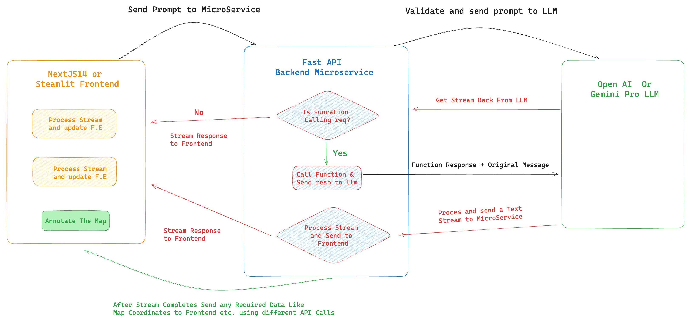
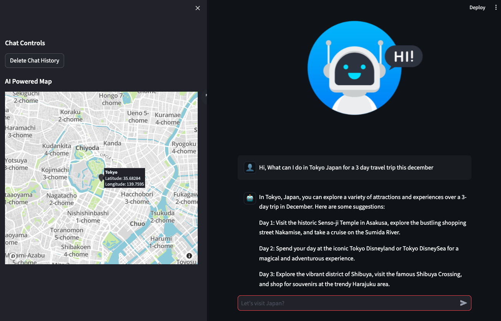

# End-to-End Cloud GenAI Travel App Streaming Project

In this project we will architect and develop an end to end streaming travel agent microservice and web app.

We will use OpenAI SDK power GenAI assistant. The Assistant can provide travel suggestions and will update map locations based in real time based on our prompt.

### TLDR - what's so special about this project?

Speed and Streaming are the marvels of Gen AI magic. At its core, streaming involves sending information in manageable chunks. 

Consider transmitting a 7 GB movie file. Rather than sending it as a whole, it's broken down into smaller, manageable 10 KB chunks. This approach provides numerous benefits!

By completing this project you will have an End to End Streaming GenAI Cloud Project. 

Your FastAPI will take prompt - connect with llms, perform function calling all while Streaming chunks back to the client.

The possibilities are endless, and the experience, unparalleled.

You will learn to create Streaming FastAPI and consume streams in both python environment (Streamlit) and TS landscape (NextJS14).

## Development Steps

The development cycle will have following stages:

0. Stage 0: Create Streaming GenAI Travel Assistant Concept in Juypyter Notebook. (For Both OpenAI and Gemini(optional))
1. Stage 1: Develop Complete Streaming Microservice in FastAPI using OPENAI SDK. We will use the Step 0 ```openai-streaming.py``` code in our fastapi microservice layers.
2. Stage 2: We will Build Docker Image and Deply our FastAPI Microservice to Google Cloud Run Containor.
3. Stage 3: Using our deplyed microservice we will create Frontend in:
   - A. Streamlit and deploy it on Google Cloud/Streamlit Cloud (Complete Frontend)
   - B. NextJS14 Frontend developed and deployed on Vercel. (You will have a Starter Kit with Google Maps and Streaming Integrated to Complete your project)

-> Note: You will firstly create the complete project using OpenAI Streaming Travel Agent. Once it's completed you will
1. Replace shelf Database with SqlAlchemy ORM and Postgress Database.
2. And then you will take the ```gemini-assistant.ipynb``` notebook and complete stages 1, 2 & 3 for it.

Here's the overall flow of our Project:



1. The Frontend will make request to our FastAPI Backend
2. Backend will validate and send prompt to OpenAI/Gemini LLM
3. We get the Stream of response Back
4. Process: Is Function Calling requied?

   - If No Send the text stream to frontend.
   - If yes call function and send the function response + prompt to llm
   - . Send the response stream to Frontend

5. Once the Stream completes we can call other endpoints (i.e: update map using coordinates or save chat in database)

## Setup Project

Create a new folder travel-ai-service and follow along. Initialize git in the root so you can commit the updates as you complete each step.

Firstly follow along and complete the end to end project using openai_streaming.ipynb file. 

Once you have completed and deployed the project then you will take the gemini_streaming ipynb and complete as a challenge

Here's what the Streamlit Frontend will be:



#### Let's go to step 0 and start building it.
